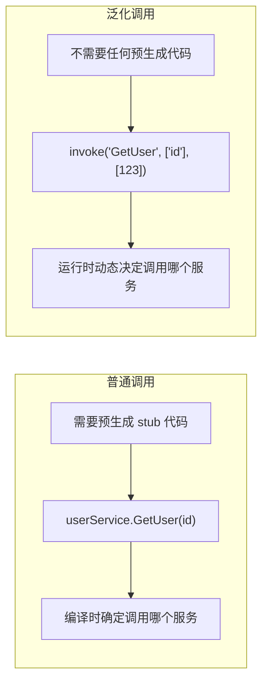
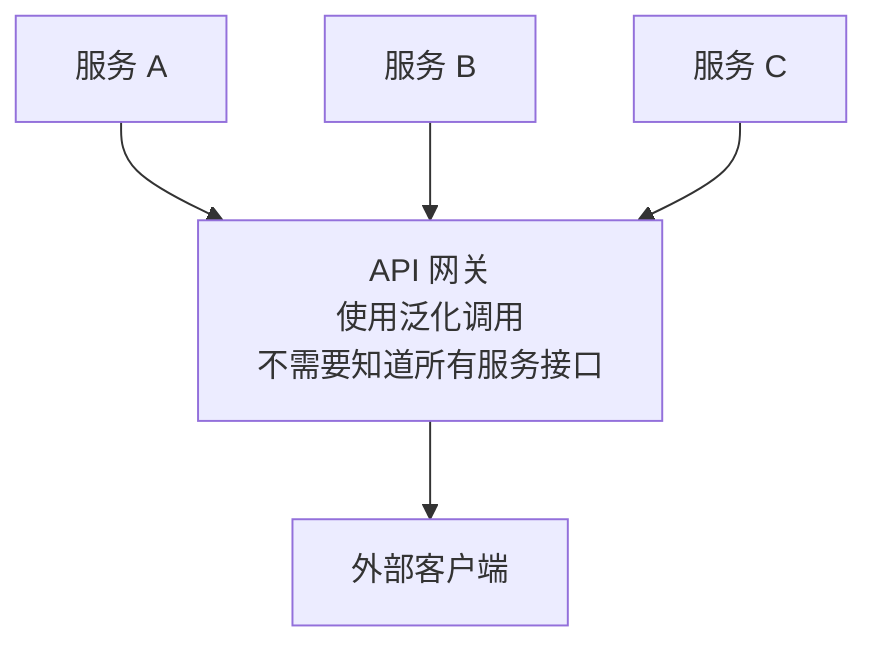
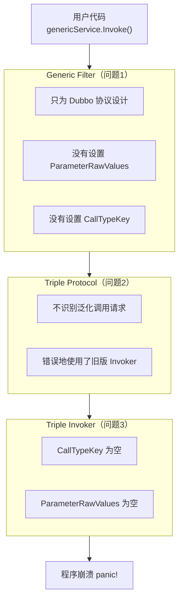
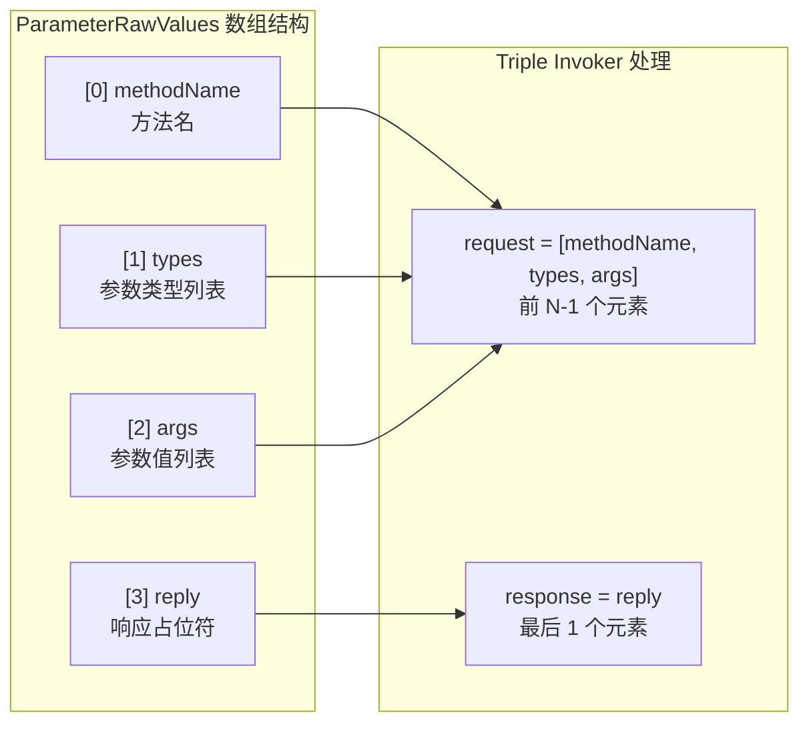
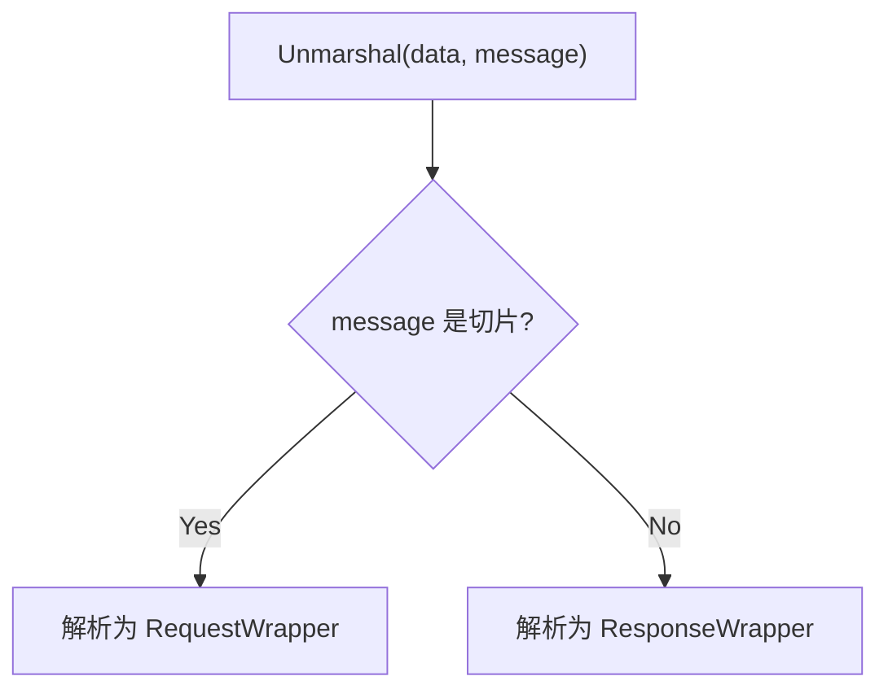
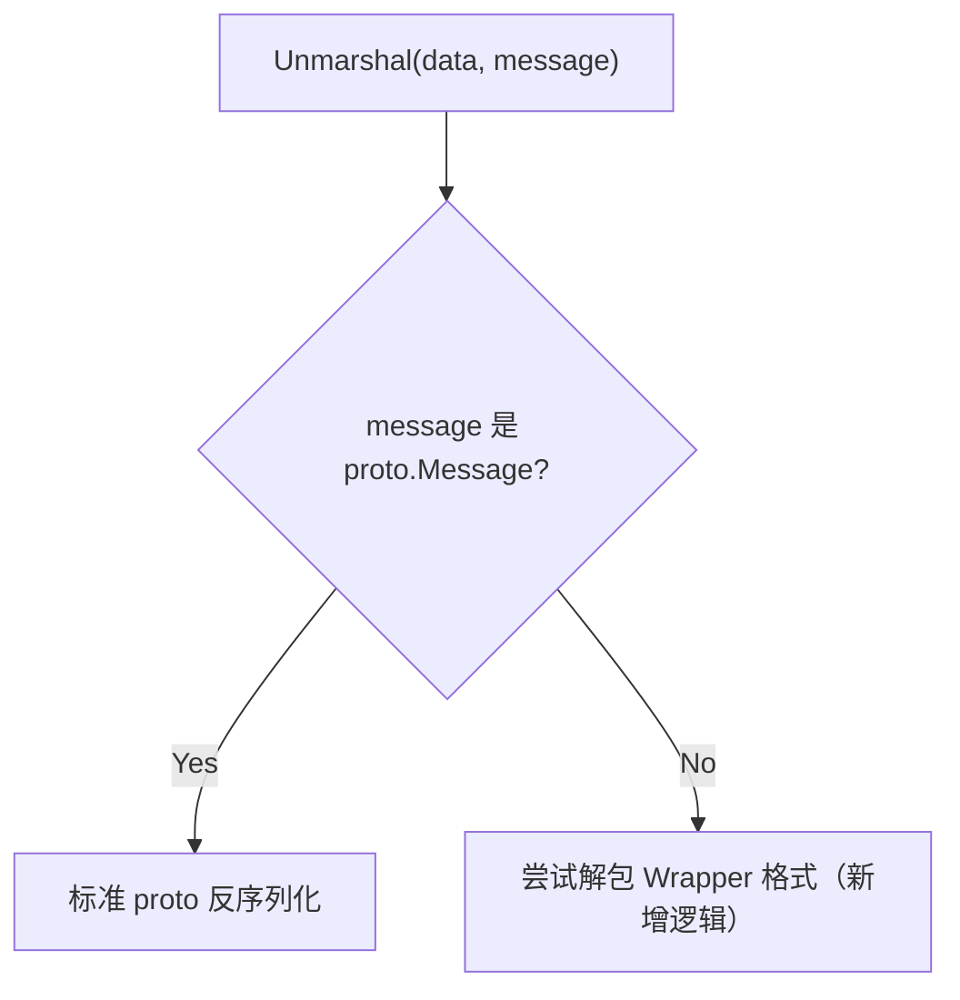
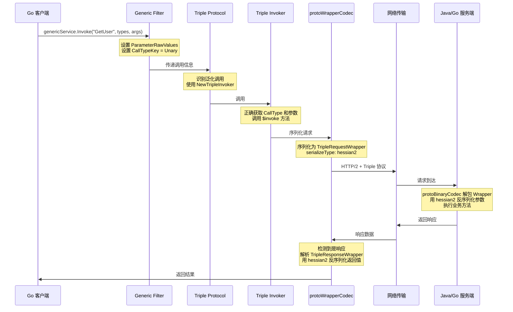

> 本文记录了我为 Apache Dubbo-Go 贡献 Triple 协议泛化调用功能的完整过程，包括问题发现、根因分析和解决方案。相关 PR：[apache/dubbo-go#3154](https://github.com/apache/dubbo-go/pull/3154)

## 什么是泛化调用？

在微服务架构中，服务之间的调用通常需要**预先生成客户端代码**（stub）。但有些场景下，我们希望能够**动态调用任意服务**，而不需要提前知道服务的接口定义。



### 泛化调用的典型应用场景



**适用场景：**
- **API 网关**：不需要为每个后端服务生成 stub
- **测试平台**：动态测试任意服务接口
- **服务治理**：统一的服务调用入口
- **跨语言调用**：Go 调用 Java、Java 调用 Go

---

## 我遇到的问题

当我尝试在 Dubbo-Go 中使用 Triple 协议进行泛化调用时，程序直接崩溃了：

```
panic: miss CallType in invocation to invoke TripleInvoker
```

这让我意识到：**Dubbo-Go 的 Triple 协议根本不支持泛化调用！**

### 问题现象

使用 Triple 协议进行泛化调用会导致程序崩溃，而使用 Dubbo 协议则正常：

| 协议 | 泛化调用结果 |
|------|-------------|
| Dubbo 协议 | 正常工作 |
| Triple 协议 | 程序崩溃："miss CallType in invocation" |

---

## 问题根因分析

经过深入调查代码，我发现问题的根源在于：**Triple 协议和 Dubbo 协议的内部实现机制完全不同，而泛化调用功能只适配了 Dubbo 协议。**

### Dubbo 协议 vs Triple 协议

| 特性 | Dubbo 协议（旧） | Triple 协议（新） |
|------|-----------------|------------------|
| 传输层 | 基于 TCP | 基于 HTTP/2 |
| 协议类型 | 私有协议 | 兼容 gRPC |
| 序列化 | Hessian2 | Protobuf |
| 参数传递 | Arguments() 直接获取 | ParameterRawValues() + CallTypeKey |

### 问题出在哪里？

我梳理了整个调用链路，发现了 **5 个关键问题点**：



即使前面的问题都解决了，还有**序列化层的问题**：

**问题 4：protoWrapperCodec**
- 只能处理"请求"（TripleRequestWrapper）
- 不能处理"响应"（TripleResponseWrapper）

**问题 5：protoBinaryCodec**
- 遇到非 Protobuf 类型直接报错
- 不支持 wrapper 格式

### 问题汇总

| 编号 | 问题位置 | 问题描述 | 影响 |
|:---:|---------|---------|------|
| 1 | Generic Filter | 没有适配 Triple 协议的参数格式 | 参数丢失 |
| 2 | Triple Protocol | 不识别泛化调用请求 | 使用错误的 Invoker |
| 3 | Triple Invoker | 找不到必要参数 | 程序崩溃 |
| 4 | protoWrapperCodec | 只能处理请求，不能处理响应 | 无法解析返回值 |
| 5 | protoBinaryCodec | 不支持 wrapper 格式 | 服务端无法解析请求 |

---

## 我的解决方案

针对上述 5 个问题，我设计了对应的解决方案：

### 解决方案总览

| 问题 | 解决方案 |
|------|---------|
| Generic Filter 参数格式不对 | 重构 Filter，设置正确的参数格式 |
| Triple Protocol 不识别泛化调用 | 增加判断逻辑，检查 generic 参数 |
| Triple Invoker 参数为空 | 由问题 1 的修复解决 |
| protoWrapperCodec 不能处理响应 | 完善 Unmarshal，支持请求和响应两种格式 |
| protoBinaryCodec 不支持 wrapper | 增强 Unmarshal，自动检测并解包 wrapper |

### 修改 1：重构 Generic Filter

让 Filter 能够正确设置 Triple 协议需要的参数：

**改造前**只设置：
- Arguments
- Reply

**改造后**同时设置：
- Arguments
- Reply
- ParameterRawValues（新增）
- CallTypeKey（新增）

ParameterRawValues 的格式设计：



### 修改 2：增强 Triple Protocol

让协议层能够识别泛化调用。

**改造前的判断逻辑：**
```go
if (有 ClientInfo) or (IDLMode == NONIDL) {
    使用 NewTripleInvoker     // 支持 Non-IDL 模式
} else {
    使用 NewDubbo3Invoker     // 只支持 IDL 模式
}
// 问题: 泛化调用既没有 ClientInfo，也没设置 IDLMode
// 所以会错误地使用 Dubbo3Invoker
```

**改造后的判断逻辑：**
```go
if (有 ClientInfo)
   or (IDLMode == NONIDL)
   or (是泛化调用)            // 新增判断
{
    使用 NewTripleInvoker
} else {
    使用 NewDubbo3Invoker
}
```

如何判断是泛化调用？

| generic 参数值 | 是否为泛化调用 |
|---------------|---------------|
| "true" | 是 |
| "gson" | 是 |
| "protobuf" | 是 |
| "protobuf-json" | 是 |
| ""（空） | 否 |

### 修改 3：完善序列化层

让序列化器能够正确处理请求和响应。

**protoWrapperCodec 改造：**



**protoBinaryCodec 改造：**



### 修改 4：新增便捷 API

为了让用户使用更方便，我还新增了一个简洁的 API：

**之前的用法（繁琐）：**
```go
// 需要手动设置很多选项
refConf := config.ReferenceConfig{
    InterfaceName: "com.example.UserService",
    Protocol:      "tri",
    Generic:       "true",
    // ... 更多配置
}
// 然后还要初始化、获取 GenericService...
```

**现在的用法（简洁）：**
```go
// 一行代码搞定
genericService, err := cli.NewGenericService(
    "com.example.UserService",
    client.WithURL("tri://127.0.0.1:50052"),
)

// 直接调用
result, err := genericService.Invoke(
    ctx,
    "GetUser",                        // 方法名
    []string{"java.lang.Long"},       // 参数类型
    []interface{}{123},               // 参数值
)
```

---

## 改造后的完整调用流程



---

## 修改文件清单

| 目录 | 文件 | 修改内容 |
|------|------|---------|
| client/ | client.go | 新增 NewGenericService |
| client/ | options.go | 新增 WithGenericType |
| filter/generic/ | filter.go | 适配 Triple 参数格式 |
| protocol/triple/ | triple.go | 新增泛化调用识别逻辑 |
| protocol/triple/ | server.go | 服务端反射调用支持 |
| protocol/triple/triple_protocol/ | codec.go | 完善序列化/反序列化 |
| protocol/triple/triple_protocol/ | codec_wrapper_test.go | 新增 625 行测试 |
| server/ | server.go | 反射调用辅助函数 |

---

## 使用示例

### 完整的客户端示例

```go
package main

import (
    "context"
    "fmt"

    "dubbo.apache.org/dubbo-go/v3/client"
    hessian "github.com/apache/dubbo-go-hessian2"
)

func main() {
    // 1. 创建 Dubbo 客户端
    cli, err := client.NewClient(
        client.WithClientProtocolTriple(),
    )
    if err != nil {
        panic(err)
    }

    // 2. 创建泛化服务（一行代码）
    genericService, err := cli.NewGenericService(
        "com.example.UserService",              // Java 服务接口名
        client.WithURL("tri://127.0.0.1:50052"), // 服务地址
    )
    if err != nil {
        panic(err)
    }

    // 3. 发起泛化调用
    result, err := genericService.Invoke(
        context.Background(),
        "GetUser",                              // 方法名
        []string{"java.lang.Long"},             // 参数类型
        []hessian.Object{int64(123)},           // 参数值
    )
    if err != nil {
        panic(err)
    }

    // 4. 处理返回结果
    // 返回值通常是 map[string]interface{}
    user := result.(map[string]interface{})
    fmt.Printf("用户名: %s\n", user["name"])
    fmt.Printf("年龄: %d\n", user["age"])
}
```

### 调用 Java 服务的效果

**Java 服务端：**
```java
@DubboService
public class UserServiceImpl implements UserService {
    public User getUser(Long id) {
        return new User(id, "张三", 25);
    }
}
```

**Go 客户端（使用泛化调用）：**
```go
result, _ := genericService.Invoke(
    ctx, "getUser",
    []string{"java.lang.Long"},
    []interface{}{123},
)

// result = map[string]interface{}{
//     "id":   123,
//     "name": "张三",
//     "age":  25,
// }
```

---

## 总结

### 解决的核心问题

| 修改前 | 修改后 |
|--------|--------|
| Triple + 泛化调用 = 程序崩溃 | Triple + 泛化调用 = 正常工作 |
| 只有 Dubbo 协议支持泛化调用 | Dubbo 和 Triple 协议都支持泛化调用 |
| Go 无法调用 Java Triple 服务 | Go 可以通过泛化调用调用任意 Java Triple 服务 |

---

## 相关链接

- **核心实现 PR**：[apache/dubbo-go#3154](https://github.com/apache/dubbo-go/pull/3154)
- **前置实现 PR**：[apache/dubbo-go#3077](https://github.com/apache/dubbo-go/pull/3077)
- **示例代码 PR**：[apache/dubbo-go-samples#1016](https://github.com/apache/dubbo-go-samples/pull/1016)
- **参考文档**：[Triple 协议泛化调用](https://www.yuque.com/xavierniu/ag9y6i/yzaq0k)

欢迎 Review 和讨论！
