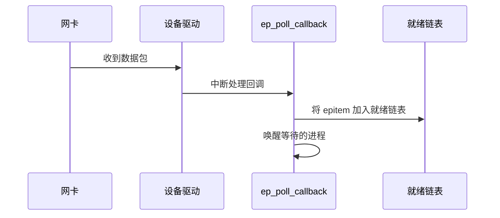
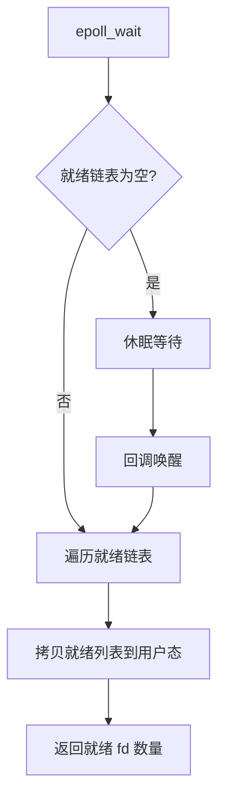
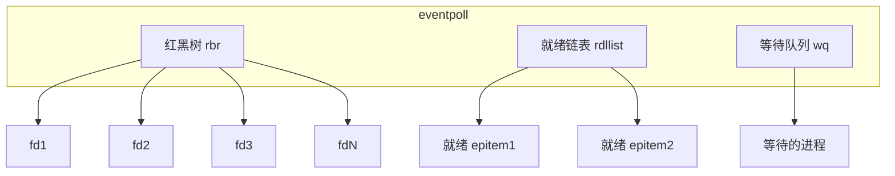
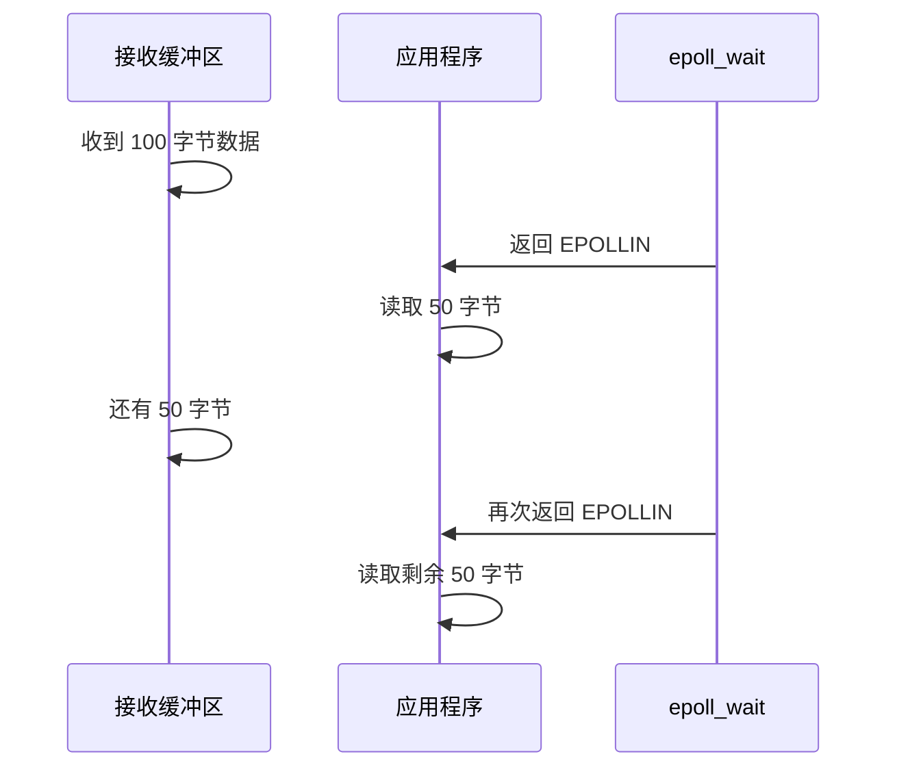
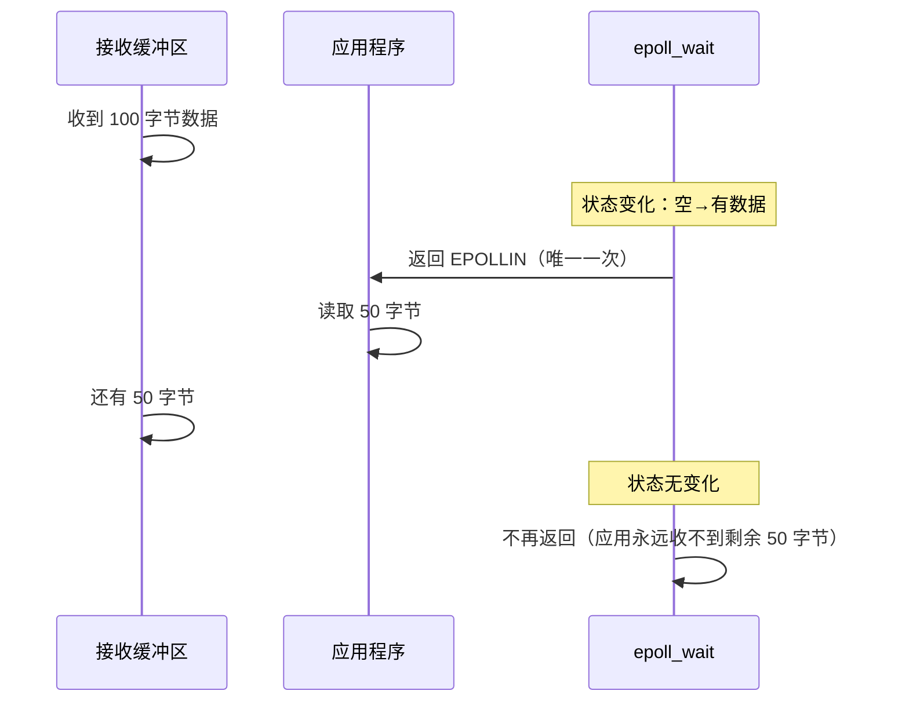
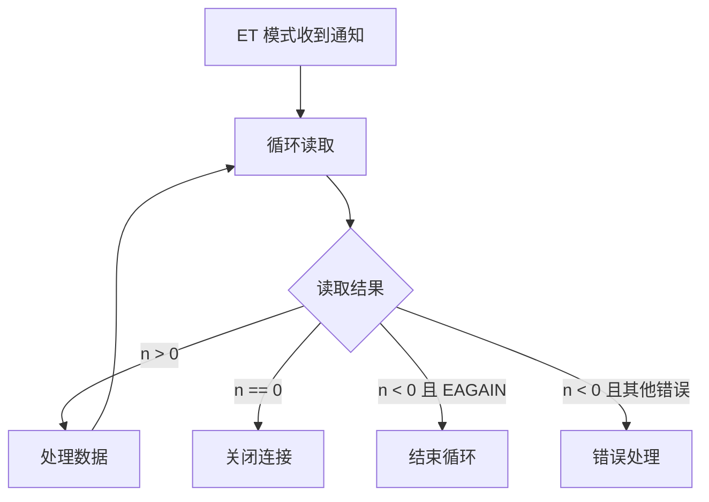

上一章我们看到了 epoll 相比 select 和 poll 的巨大性能优势。但 epoll 究竟是怎么做到的？让我们深入内核，看看它的核心原理。

## 三个核心 API

epoll 的设计哲学是：**简单而强大**。它只提供了三个系统调用，但每个调用都极其高效。

| API             | 功能              | 复杂度   | 使用频率            |
| --------------- | ----------------- | -------- | ------------------- |
| `epoll_create1` | 创建 epoll 实例   | O(1)     | 程序启动时调用一次  |
| `epoll_ctl`     | 添加/删除/修改 fd | O(log n) | 连接建立/断开时调用 |
| `epoll_wait`    | 等待事件          | O(k)     | 事件循环中持续调用  |

**注意**：这里的 k 是**就绪的 fd 数量**，而不是总连接数！这就是 epoll 快速的关键。

### epoll_create1：创建 epoll 实例

这是 epoll 的第一步，就像盖房子要先打地基。

```c
#include <stdio.h>
#include <stdlib.h>
#include <sys/epoll.h>

int main() {
    // 创建 epoll 实例
    // 参数 flags 可以是 0 或 EPOLL_CLOEXEC
    // EPOLL_CLOEXEC: 在 exec 系统调用时自动关闭
    int epfd = epoll_create1(0);
    if (epfd == -1) {
        perror("epoll_create1");
        exit(EXIT_FAILURE);
    }

    printf("epoll instance created: fd = %d\n", epfd);

    // 使用完毕后关闭
    close(epfd);

    return 0;
}
```

```bash
# 编译运行
gcc epoll_create1_demo.c -o epoll_create1_demo
./epoll_create1_demo

# 输出：
# epoll instance created: fd = 3
```

#### epoll_create1 到底做了什么？

让我带你看看内核层面的实现（简化版）：

```c
// 内核源码：fs/eventpoll.c
SYSCALL_DEFINE1(epoll_create1, int, flags) {
    // 1. 检查参数
    if (flags & ~EPOLL_CLOEXEC) {
        return -EINVAL;
    }

    // 2. 创建 eventpoll 对象
    struct eventpoll *ep = NULL;

    // 分配内存
    ep = kzalloc(sizeof(*ep), GFP_KERNEL);
    if (!ep) {
        return -ENOMEM;
    }

    // 3. 初始化红黑树
    // 红黑树用于高效管理所有监听的 fd
    ep->rbr = RB_ROOT;

    // 4. 初始化就绪链表
    // 双向链表用于存储有事件的 fd
    INIT_LIST_HEAD(&ep->rdllist);

    // 5. 初始化等待队列
    // 用于管理等待事件的进程
    init_waitqueue_head(&ep->wq);

    // 6. 创建一个匿名文件，返回其 fd
    // 为什么这样做？为了统一接口，让 epoll 本身也可以被 epoll 管理
    struct file *file;
    int fd = get_unused_fd_flags(O_RDWR | (flags & O_CLOEXEC));
    if (fd < 0) {
        kfree(ep);
        return fd;
    }

    file = anon_inode_getfile("[eventpoll]", &eventpoll_fops, ep, O_RDWR | (flags & O_CLOEXEC));
    if (IS_ERR(file)) {
        put_unused_fd(fd);
        kfree(ep);
        return PTR_ERR(file);
    }

    // 7. 将 fd 和 file 关联
    fd_install(fd, file);

    // 8. 返回 fd
    return fd;
}
```

看到没有？`epoll_create1` 做了这么一大堆事情：

1. **创建 eventpoll 对象**：这是 epoll 的核心数据结构
2. **初始化红黑树**：后续插入、删除、查找 fd 都依赖它
3. **初始化就绪链表**：用于高效返回就绪的 fd
4. **初始化等待队列**：当没有事件时，进程会在这里休眠
5. **创建匿名文件**：返回一个 fd，让 epoll 本身可以被 select/poll 管理

#### 为什么要用匿名文件？

这是一个非常聪明的设计：

```c
// epoll 本身也可以被 epoll 管理！
int epfd1 = epoll_create1(0);
int epfd2 = epoll_create1(0);

// 将 epfd1 添加到 epfd2 的监听列表中
struct epoll_event event;
event.events = EPOLLIN;
event.data.fd = epfd1;
epoll_ctl(epfd2, EPOLL_CTL_ADD, epfd1, &event);
```

这种嵌套设计在复杂场景中非常有用，比如：

- **分层监控**：一个 epoll 监控其他多个 epoll
- **热更新**：动态替换 epoll 实例而不影响上层
- **调试**：监控 epoll 本身的状态

#### 内核数据结构：eventpoll

```c
// 内核源码：include/linux/eventpoll.h
struct eventpoll {
    // 红黑树根节点
    // 用于管理所有监听的 fd
    struct rb_root rbr;

    // 就绪链表头
    // 双向链表，存储有事件的 fd
    struct list_head rdllist;

    // 等待队列
    // 当没有事件时，进程会在这里休眠
    wait_queue_head_t wq;

    // 就绪事件的锁
    spinlock_t lock;

    // 用户空间的等待队列
    // 用于 epoll_wait 调用
    wait_queue_head_t poll_wait;

    // 当前活跃的 fd 数量
    int epitems_nr;

    // 用户态 mmap 的页面
    // 用于零拷贝优化
    struct user_struct *user;
    struct file *file;
};
```

#### 实际使用技巧

```c
#include <stdio.h>
#include <stdlib.h>
#include <sys/epoll.h>
#include <unistd.h>

int create_epoll_instance() {
    // 使用 EPOLL_CLOEXEC 避免子进程继承
    int epfd = epoll_create1(EPOLL_CLOEXEC);
    if (epfd == -1) {
        perror("epoll_create1");
        return -1;
    }

    // 调整监听队列的大小（从 Linux 2.6.8 开始）
    // 这个参数只是建议，内核会自动调整
    // 如果不传或传 0，内核会根据实际连接数动态调整
    // 所以在现代 Linux 上，这个参数基本没什么用

    printf("Created epoll instance: fd = %d\n", epfd);
    return epfd;
}

int main() {
    int epfd = create_epoll_instance();
    if (epfd == -1) {
        exit(EXIT_FAILURE);
    }

    // 使用 epoll...
    // epoll_ctl(epfd, ...);
    // epoll_wait(epfd, ...);

    close(epfd);
    return 0;
}
```

#### 常见错误和调试

```c
// 错误 1: 忘记检查返回值
int epfd = epoll_create1(0);
// 错误！应该检查 epfd == -1

// 正确做法
int epfd = epoll_create1(0);
if (epfd == -1) {
    perror("epoll_create1");
    exit(EXIT_FAILURE);
}

// 错误 2: 忘记关闭 fd
int epfd = epoll_create1(0);
// 使用完毕后没有 close，会导致 fd 泄漏

// 正确做法
int epfd = epoll_create1(0);
if (epfd == -1) {
    perror("epoll_create1");
    exit(EXIT_FAILURE);
}

// 使用完毕后关闭
close(epfd);

// 错误 3: 多次创建不关闭
for (int i = 0; i < 100000; i++) {
    int epfd = epoll_create1(0);
    // 忘记关闭！
}
// 结果：fd 泄漏，最终达到系统限制

// 错误 4: 使用错误的 flags
int epfd = epoll_create1(EPOLLIN);  // 错误！EPOLLIN 不是这里的 flag
// EPOLL_CLOEXEC 是唯一有效的 flag
```

```bash
# 调试技巧：查看进程打开的文件描述符
ls -l /proc/$(pgof your_server)/fd | grep epoll

# 查看系统最大 fd 数量
cat /proc/sys/fs/file-max

# 查看当前进程的 fd 数量
ls /proc/$(pgof your_server)/fd | wc -l
```

### epoll_ctl：管理监听列表

如果说 `epoll_create1` 是打地基，那 `epoll_ctl` 就是盖房子的过程：添加、删除、修改监听的 fd。

```c
#include <stdio.h>
#include <stdlib.h>
#include <sys/epoll.h>
#include <fcntl.h>

// epoll 事件类型
#define EPOLLIN      0x001  // 可读
#define EPOLLOUT     0x004  // 可写
#define EPOLLPRI     0x002  // 紧急数据
#define EPOLLERR     0x008  // 错误
#define EPOLLHUP     0x010  // 挂起
#define EPOLLET      1 << 31  // 边缘触发模式
#define EPOLLONESHOT 1 << 30  // 一次性监听

// 设置 socket 为非阻塞模式
int set_nonblocking(int sockfd) {
    int flags = fcntl(sockfd, F_GETFL, 0);
    if (flags == -1) {
        perror("fcntl(F_GETFL)");
        return -1;
    }
    if (fcntl(sockfd, F_SETFL, flags | O_NONBLOCK) == -1) {
        perror("fcntl(F_SETFL)");
        return -1;
    }
    return 0;
}

// 添加 fd 到 epoll
int add_to_epoll(int epfd, int fd, uint32_t events) {
    struct epoll_event event;
    event.events = events;
    event.data.fd = fd;

    if (epoll_ctl(epfd, EPOLL_CTL_ADD, fd, &event) == -1) {
        perror("epoll_ctl(ADD)");
        return -1;
    }

    printf("Added fd %d to epoll %d with events 0x%x\n", fd, epfd, events);
    return 0;
}

// 从 epoll 删除 fd
int remove_from_epoll(int epfd, int fd) {
    if (epoll_ctl(epfd, EPOLL_CTL_DEL, fd, NULL) == -1) {
        perror("epoll_ctl(DEL)");
        return -1;
    }

    printf("Removed fd %d from epoll %d\n", fd, epfd);
    return 0;
}

// 修改 fd 的事件类型
int modify_epoll_event(int epfd, int fd, uint32_t new_events) {
    struct epoll_event event;
    event.events = new_events;
    event.data.fd = fd;

    if (epoll_ctl(epfd, EPOLL_CTL_MOD, fd, &event) == -1) {
        perror("epoll_ctl(MOD)");
        return -1;
    }

    printf("Modified fd %d events to 0x%x\n", fd, new_events);
    return 0;
}

int main() {
    int epfd = epoll_create1(0);
    if (epfd == -1) {
        perror("epoll_create1");
        exit(EXIT_FAILURE);
    }

    // 假设我们有一个 socket fd
    int sockfd = socket(AF_INET, SOCK_STREAM, 0);
    set_nonblocking(sockfd);

    // 添加到 epoll，监听可读事件，使用边缘触发模式
    add_to_epoll(epfd, sockfd, EPOLLIN | EPOLLET);

    // 稍后，如果我们想修改事件类型（比如也监听可写）
    modify_epoll_event(epfd, sockfd, EPOLLIN | EPOLLOUT | EPOLLET);

    // 最后，从 epoll 中删除
    remove_from_epoll(epfd, sockfd);

    close(sockfd);
    close(epfd);

    return 0;
}
```

#### epoll_ctl 的三种操作

| 操作 | 常量            | 说明                 | 使用场景       |
| ---- | --------------- | -------------------- | -------------- |
| 添加 | `EPOLL_CTL_ADD` | 添加新 fd 到监听列表 | 新连接建立时   |
| 删除 | `EPOLL_CTL_DEL` | 从监听列表删除 fd    | 连接关闭时     |
| 修改 | `EPOLL_CTL_MOD` | 修改已监听 fd 的事件 | 改变监听类型时 |

#### 内核实现：epoll_ctl 做了什么？

```c
// 内核源码：fs/eventpoll.c
SYSCALL_DEFINE4(epoll_ctl, int, epfd, int, op, int, fd,
        struct epoll_event __user *, event) {
    // 1. 查找 epoll 实例
    struct file *file = fget(epfd);
    struct eventpoll *ep = file->private_data;

    // 2. 查找目标 fd
    struct file *tfile = fget(fd);

    // 3. 根据操作类型处理
    switch (op) {
    case EPOLL_CTL_ADD:
        // 添加 fd 到 epoll
        error = ep_insert(ep, &epds, tfile, fd, full_check);
        break;

    case EPOLL_CTL_DEL:
        // 从 epoll 删除 fd
        error = ep_remove(ep, epds, tfile);
        break;

    case EPOLL_CTL_MOD:
        // 修改 fd 的事件
        error = ep_modify(ep, epds, tfile);
        break;
    }

    return error;
}

// ep_insert：添加 fd 到 epoll
static int ep_insert(struct eventpoll *ep,
                     const struct epoll_event *event,
                     struct file *tfile, int fd, int full_check) {
    // 1. 检查是否已经存在
    if (ep_find(ep, tfile, fd) != NULL) {
        return -EEXIST;
    }

    // 2. 创建 epitem（每个 fd 对应一个 epitem）
    struct epitem *epi = kmem_cache_alloc(epi_cache, GFP_KERNEL);
    if (!epi) {
        return -ENOMEM;
    }

    // 3. 初始化 epitem
    INIT_LIST_HEAD(&epi->rdllink);
    epi->ep = ep;
    epi->file = tfile;
    epi->fd = fd;
    epi->event = *event;

    // 4. 设置回调函数
    // 这是 epoll 的核心魔法！
    ep_item_ops(epi, &epi->epi_file_ops);
    epi->epi_file_ops.f_op->poll = ep_ptable_queue_proc;

    // 5. 将 epitem 插入红黑树
    // 时间复杂度：O(log n)
    ep_rbtree_insert(ep, epi);

    // 6. 注册回调函数到文件系统
    // 当文件状态变化时，会调用我们的回调
    mutex_lock(&tfile->f_pos_lock);
    if (tfile->f_op->poll) {
        revents = tfile->f_op->poll(tfile, &epq.pt);
    }
    mutex_unlock(&tfile->f_pos_lock);

    return 0;
}
```

#### 回调机制：epoll 的魔法

这是 epoll 最核心、最巧妙的设计！

```c
// 回调函数
static int ep_ptable_queue_proc(struct file *file, wait_queue_head_t *whead,
                                poll_table *pt) {
    struct epitem *epi = ep_item_from_epqueue(pt);

    // 1. 创建等待队列项
    struct eppoll_entry *pwq;
    pwq = kmem_cache_alloc(pwq_cache, GFP_KERNEL);
    if (!pwq) {
        return -ENOMEM;
    }

    // 2. 初始化等待队列项
    init_waitqueue_func_entry(&pwq->wait, ep_poll_callback);
    pwq->whead = whead;
    pwq->base = epi;

    // 3. 添加到等待队列
    // 当文件状态变化时，会唤醒这个等待队列
    add_wait_queue(whead, &pwq->wait);

    return 0;
}

// 当文件状态变化时，内核会调用这个回调
static int ep_poll_callback(wait_queue_entry_t *wait, unsigned mode, int sync,
                            void *key) {
    struct epitem *epi = ep_item_from_wait(wait);
    struct eventpoll *ep = epi->ep;

    // 1. 将 epitem 加入就绪链表
    // 时间复杂度：O(1)
    if (!ep_is_linked(&epi->rdllink)) {
        list_add_tail(&epi->rdllink, &ep->rdllist);
    }

    // 2. 唤醒等待的进程
    if (waitqueue_active(&ep->wq)) {
        wake_up_locked(&ep->wq);
    }

    return 0;
}
```

#### 完整的流程图

```
应用层
  |
  | epoll_ctl(epfd, EPOLL_CTL_ADD, fd, &event)
  v
内核层
  |
  | 1. 创建 epitem
  v
  ep_insert(ep, event, file, fd)
  |
  | 2. 初始化 epitem
  v
  epi->ep = ep
  epi->file = file
  epi->fd = fd
  |
  | 3. 设置回调函数
  v
  epi->epi_file_ops.f_op->poll = ep_ptable_queue_proc
  |
  | 4. 插入红黑树
  v
  ep_rbtree_insert(ep, epi)
  |
  | 5. 注册到文件系统
  v
  file->f_op->poll = ep_ptable_queue_proc
  |
  | 6. 等待事件...
  v
时间流逝...
  |
  | 7. 文件状态变化（比如收到数据）
  v
  内核中断处理
  |
  | 8. 调用回调函数
  v
  ep_poll_callback()
  |
  | 9. 加入就绪链表
  v
  list_add_tail(&epi->rdllink, &ep->rdllist)
  |
  | 10. 唤醒进程
  v
  wake_up(&ep->wq)
  |
  v
应用层 epoll_wait() 返回
```

#### 实战：完整的示例

```c
#include <stdio.h>
#include <stdlib.h>
#include <string.h>
#include <unistd.h>
#include <fcntl.h>
#include <sys/socket.h>
#include <netinet/in.h>
#include <sys/epoll.h>

#define MAX_EVENTS 64
#define BUFFER_SIZE 1024

int set_nonblocking(int sockfd) {
    int flags = fcntl(sockfd, F_GETFL, 0);
    if (flags == -1) return -1;
    return fcntl(sockfd, F_SETFL, flags | O_NONBLOCK);
}

int main() {
    int server_fd, epfd, client_fd;
    struct sockaddr_in address;
    struct epoll_event event, events[MAX_EVENTS];
    char buffer[BUFFER_SIZE];
    int n;

    // 创建 socket
    server_fd = socket(AF_INET, SOCK_STREAM, 0);
    set_nonblocking(server_fd);

    address.sin_family = AF_INET;
    address.sin_addr.s_addr = INADDR_ANY;
    address.sin_port = htons(8080);

    bind(server_fd, (struct sockaddr*)&address, sizeof(address));
    listen(server_fd, SOMAXCONN);

    // 创建 epoll 实例
    epfd = epoll_create1(0);
    if (epfd == -1) {
        perror("epoll_create1");
        exit(EXIT_FAILURE);
    }

    // 添加服务器 socket 到 epoll
    event.events = EPOLLIN;
    event.data.fd = server_fd;
    if (epoll_ctl(epfd, EPOLL_CTL_ADD, server_fd, &event) == -1) {
        perror("epoll_ctl(server_fd)");
        exit(EXIT_FAILURE);
    }

    printf("Server started on port 8080\n");

    while (1) {
        // 等待事件
        n = epoll_wait(epfd, events, MAX_EVENTS, -1);
        if (n == -1) {
            perror("epoll_wait");
            break;
        }

        // 处理事件
        for (int i = 0; i < n; i++) {
            if (events[i].data.fd == server_fd) {
                // 新连接
                while ((client_fd = accept(server_fd, NULL, NULL)) != -1) {
                    set_nonblocking(client_fd);

                    event.events = EPOLLIN | EPOLLET;
                    event.data.fd = client_fd;
                    if (epoll_ctl(epfd, EPOLL_CTL_ADD, client_fd, &event) == -1) {
                        perror("epoll_ctl(client_fd)");
                        close(client_fd);
                    } else {
                        printf("New connection: fd %d\n", client_fd);
                    }
                }

                if (errno != EAGAIN && errno != EWOULDBLOCK) {
                    perror("accept");
                }
            } else {
                // 已有连接的数据
                int fd = events[i].data.fd;
                while (1) {
                    ssize_t count = read(fd, buffer, BUFFER_SIZE);
                    if (count == -1) {
                        if (errno != EAGAIN && errno != EWOULDBLOCK) {
                            perror("read");
                            epoll_ctl(epfd, EPOLL_CTL_DEL, fd, NULL);
                            close(fd);
                            printf("Connection closed: fd %d\n", fd);
                        }
                        break;
                    } else if (count == 0) {
                        epoll_ctl(epfd, EPOLL_CTL_DEL, fd, NULL);
                        close(fd);
                        printf("Connection closed: fd %d\n", fd);
                        break;
                    } else {
                        write(fd, buffer, count);
                    }
                }
            }
        }
    }

    close(server_fd);
    close(epfd);

    return 0;
}
```

```bash
# 编译运行
gcc epoll_server.c -o epoll_server
./epoll_server

# 在另一个终端测试
nc localhost 8080
```

#### 常见错误和调试

```c
// 错误 1: 忘记设置非阻塞模式
client_fd = accept(server_fd, NULL, NULL);
event.events = EPOLLIN | EPOLLET;
epoll_ctl(epfd, EPOLL_CTL_ADD, client_fd, &event);
// 错误！使用边缘触发必须设置非阻塞模式

// 正确做法
client_fd = accept(server_fd, NULL, NULL);
set_nonblocking(client_fd);  // 必须先设置为非阻塞
event.events = EPOLLIN | EPOLLET;
epoll_ctl(epfd, EPOLL_CTL_ADD, client_fd, &event);

// 错误 2: 重复添加同一个 fd
epoll_ctl(epfd, EPOLL_CTL_ADD, fd, &event);
epoll_ctl(epfd, EPOLL_CTL_ADD, fd, &event);  // 错误！会返回 EEXIST

// 正确做法：先用 EPOLL_CTL_MOD，如果失败再用 EPOLL_CTL_ADD
if (epoll_ctl(epfd, EPOLL_CTL_MOD, fd, &event) == -1) {
    if (errno == ENOENT) {
        // fd 不存在，添加
        epoll_ctl(epfd, EPOLL_CTL_ADD, fd, &event);
    } else {
        perror("epoll_ctl(MOD)");
    }
}

// 错误 3: 删除后继续使用
epoll_ctl(epfd, EPOLL_CTL_DEL, fd, NULL);
read(fd, buffer, BUFFER_SIZE);  // 错误！fd 已经被删除

// 正确做法：删除前先使用
read(fd, buffer, BUFFER_SIZE);
epoll_ctl(epfd, EPOLL_CTL_DEL, fd, NULL);
close(fd);
```

#### 调试技巧

```c
// 打印 epoll 的状态
void print_epoll_status(int epfd) {
    // 读取 /proc/[pid]/fdinfo/[fd]
    char path[256];
    snprintf(path, sizeof(path), "/proc/%d/fdinfo/%d", getpid(), epfd);

    FILE *fp = fopen(path, "r");
    if (!fp) {
        perror("fopen");
        return;
    }

    printf("Epoll status for fd %d:\n", epfd);
    char line[1024];
    while (fgets(line, sizeof(line), fp)) {
        printf("  %s", line);
    }

    fclose(fp);
}
```

```bash
# 使用 strace 跟踪 epoll 系统调用
strace -e trace=epoll_create1,epoll_ctl,epoll_wait -p $(pgof your_server)

# 查看 epoll 监听的 fd 数量
ls -l /proc/$(pgof your_server)/fd | grep -c "anon_inode:\[eventpoll]"

# 查看 epoll 实例的详细信息
cat /proc/$(pgof your_server)/fdinfo/$(ls -l /proc/$(pgof your_server)/fd | grep "anon_inode:\[eventpoll]" | awk '{print $9}')
```

#### 性能优化建议

```c
// 优化 1: 批量添加 fd
int batch_add_to_epoll(int epfd, int fds[], int count, uint32_t events) {
    struct epoll_event event;
    event.events = events;

    for (int i = 0; i < count; i++) {
        event.data.fd = fds[i];
        if (epoll_ctl(epfd, EPOLL_CTL_ADD, fds[i], &event) == -1) {
            perror("epoll_ctl");
            return -1;
        }
    }
    return 0;
}

// 优化 2: 使用 EPOLLONESHOT 避免惊群
event.events = EPOLLIN | EPOLLONESHOT;
epoll_ctl(epfd, EPOLL_CTL_ADD, fd, &event);

// 处理完事件后，重新添加
epoll_ctl(epfd, EPOLL_CTL_MOD, fd, &event);

// 优化 3: 使用 EPOLLET 减少系统调用
event.events = EPOLLIN | EPOLLET;
epoll_ctl(epfd, EPOLL_CTL_ADD, fd, &event);
```

### epoll_ctl 的回调机制

这是 epoll 的核心魔法。

当调用 `epoll_ctl` 添加一个 fd 时，内核会做以下事情：

```go
// 伪代码：内核层面的实现
func ep_insert(ep *eventpoll, fd int) error {
    // 1. 在红黑树中创建 epitem
    epi := rbInsert(ep.rbTree, fd)

    // 2. 设置回调函数
    epi.callback = epPollCallback

    // 3. 注册到设备驱动
    deviceRegisterCallback(fd, epi.callback)

    return nil
}
```

这个回调函数很重要。当网卡收到数据时，设备驱动会调用它：



### epoll_wait：等待事件

```go
package main

import (
    "fmt"
    "syscall"
)

const MAX_EVENTS = 64

func waitForEvents(epfd int) {
    events := make([]syscall.EpollEvent, MAX_EVENTS)

    // 等待事件发生
    n, err := syscall.EpollWait(epfd, events, -1)
    if err != nil {
        panic(err)
    }

    // 处理就绪事件
    for i := 0; i < n; i++ {
        fd := int(events[i].Fd)
        if events[i].Events&EPOLLIN != 0 {
            // 读取数据
            buffer := make([]byte, 1024)
            syscall.Read(fd, buffer)
            fmt.Printf("Read from fd %d: %s\n", fd, string(buffer))
        }
    }
}
```

`epoll_wait` 做的事情很简单：



复杂度：O(k)，k 是就绪的 fd 数量，不是总连接数。

## 核心数据结构

### eventpoll：epoll 的核心对象

```c
// 内核源码：include/linux/eventpoll.h
struct eventpoll {
    // 红黑树根节点，管理所有监听的 fd
    // 插入、删除、查找都是 O(log n)
    struct rb_root rbr;

    // 就绪链表，双向链表，存储有事件的 fd
    // 遍历是 O(k)，k 是就绪的 fd 数量
    struct list_head rdllist;

    // 等待队列，存放等待事件的进程
    wait_queue_head_t wq;

    // 用户态的等待队列
    wait_queue_head_t poll_wait;

    // 保护 rdllist 的锁
    spinlock_t lock;

    // 就绪事件的列表（用于 ep_send_events）
    struct list_head ovelle;

    // 当前活跃的 fd 数量
    int epitems_nr;

    // 用户态 mmap 的页面
    struct user_struct *user;
    struct file *file;
};
```

**关键数据结构的关系：**

```
eventpoll
  |
  |--- rbr (红黑树)
  |     |
  |     |--- epitem (fd1)
  |     |--- epitem (fd2)
  |     |--- epitem (fd3)
  |     |--- ... (fdN)
  |
  |--- rdllist (就绪链表)
  |     |
  |     |--- epitem (就绪的 fd)
  |     |--- epitem (就绪的 fd)
  |     |--- epitem (就绪的 fd)
  |
  |--- wq (等待队列)
        |
        |--- 等待的进程 1
        |--- 等待的进程 2
        |--- 等待的进程 3
```

### epitem：每个 fd 的信息

```c
// 内核源码：fs/eventpoll.c
struct epitem {
    // 红黑树节点
    struct rb_node rbn;

    // 就绪链表节点
    struct list_head rdllink;

    // 所属的 eventpoll
    struct eventpoll *ep;

    // 关联的文件
    struct file *file;

    // 监听的 fd
    int fd;

    // 监听的事件
    struct epoll_event event;

    // 文件系统的等待队列
    struct eppoll_entry *pwqlist;

    // 用于延迟删除
    struct rcu_head rcu;
};
```

**epitem 的生命周期：**

```
创建 (ep_insert)
  |
  | 1. 分配内存
  | 2. 初始化字段
  | 3. 设置回调函数
  | 4. 插入红黑树
  v
就绪 (回调触发)
  |
  | 1. 加入就绪链表
  | 2. 唤醒进程
  v
处理 (epoll_wait)
  |
  | 1. 从就绪链表移除
  | 2. 拷贝到用户态
  v
删除 (ep_remove)
  |
  | 1. 从红黑树移除
  | 2. 从就绪链表移除
  | 3. 注销回调函数
  | 4. 释放内存
  v
销毁
```

### epoll_event：用户态和内核态的桥梁

```c
// 用户态和内核态共享的结构体
struct epoll_event {
    // 监听的事件类型
    uint32_t events;

    // 用户数据（联合体）
    union {
        void *ptr;
        int fd;
        uint32_t u32;
        uint64_t u64;
    } data;
};
```

**事件类型详解：**

| 事件             | 值      | 说明       | 使用场景            |
| ---------------- | ------- | ---------- | ------------------- |
| `EPOLLIN`        | 0x001   | 可读       | socket 有数据可读   |
| `EPOLLOUT`       | 0x004   | 可写       | socket 可以发送数据 |
| `EPOLLPRI`       | 0x002   | 紧急数据   | socket 收到带外数据 |
| `EPOLLERR`       | 0x008   | 错误       | socket 发生错误     |
| `EPOLLHUP`       | 0x010   | 挂起       | 对方关闭连接        |
| `EPOLLET`        | 1 << 31 | 边缘触发   | 高性能模式          |
| `EPOLLONESHOT`   | 1 << 30 | 一次性监听 | 避免惊群            |
| `EPOLLEXCLUSIVE` | 1 << 28 | 独占模式   | 多个进程监听同一 fd |

**使用示例：**

```c
// 监听可读事件，使用边缘触发模式
struct epoll_event event;
event.events = EPOLLIN | EPOLLET;
event.data.fd = sockfd;
epoll_ctl(epfd, EPOLL_CTL_ADD, sockfd, &event);

// 监听可读和可写事件，使用一次性监听
event.events = EPOLLIN | EPOLLOUT | EPOLLONESHOT;
event.data.fd = sockfd;
epoll_ctl(epfd, EPOLL_CTL_ADD, sockfd, &event);

// 监听所有事件（包括错误和挂起）
event.events = EPOLLIN | EPOLLOUT | EPOLLERR | EPOLLHUP;
event.data.fd = sockfd;
epoll_ctl(epfd, EPOLL_CTL_ADD, sockfd, &event);
```

#### data 联合体的使用技巧

```c
// 技巧 1: 直接传递 fd
event.data.fd = sockfd;
epoll_ctl(epfd, EPOLL_CTL_ADD, sockfd, &event);

// 在 epoll_wait 中直接使用
int fd = events[i].data.fd;

// 技巧 2: 传递指针（用于复杂对象）
struct client_conn {
    int fd;
    char name[32];
    // ... 其他字段
};

struct client_conn *conn = malloc(sizeof(struct client_conn));
conn->fd = sockfd;
strcpy(conn->name, "client-1");

event.data.ptr = conn;
epoll_ctl(epfd, EPOLL_CTL_ADD, sockfd, &event);

// 在 epoll_wait 中获取
struct client_conn *conn = events[i].data.ptr;
int fd = conn->fd;
printf("Client name: %s\n", conn->name);
```



### epitem：每个 fd 的信息

```go
// 伪代码：内核数据结构
type epitem struct {
    // 红黑树节点
    rbn *rbNode

    // 双向链表节点
    rdllink *list.Element

    // 所属的 eventpoll
    ep *eventpoll

    // 监听的 fd
    fd int

    // 监听的事件
    event *epollEvent

    // 关联的文件
    file *file
}
```

### epoll_event：用户态和内核态的桥梁

```go
// Go 中的 epoll 事件结构
type EpollEvent struct {
    Events uint32 // 监听的事件类型
    Fd     int32  // 文件描述符
}
```

事件类型：

| 事件         | 含义         | Go 常量      |
| ------------ | ------------ | ------------ |
| EPOLLIN      | 可读         | EPOLLIN      |
| EPOLLOUT     | 可写         | EPOLLOUT     |
| EPOLLPRI     | 紧急数据     | EPOLLPRI     |
| EPOLLERR     | 错误         | EPOLLERR     |
| EPOLLHUP     | 对方关闭连接 | EPOLLHUP     |
| EPOLLET      | 边缘触发模式 | EPOLLET      |
| EPOLLONESHOT | 一次性监听   | EPOLLONESHOT |

## 边缘触发 vs 水平触发

这是 epoll 最重要的概念之一。

### 水平触发（LT，Level Triggered）

默认模式。

```go
event.Events = EPOLLIN
```

特点：

- **只要缓冲区有数据**，`epoll_wait` 就会返回
- **支持阻塞和非阻塞** socket
- **可以不一次性读完数据**，下次 `epoll_wait` 还会返回



### 边缘触发（ET，Edge Triggered）

边缘触发是高性能模式，它只在状态变化时通知一次。

**工作原理：**

```
状态变化：
  空缓冲区 -> 有数据：触发通知（从无到有）
  有数据   -> 更多数据：不触发通知（状态未变）
  有数据   -> 空缓冲区：不触发通知（状态已变，但这是数据读取导致）

关键：只在"有数据"这一瞬态通知！
```

**特点：**

1. **只在状态变化时通知**：从无数据到有数据时通知一次
2. **必须使用非阻塞 socket**：ET 模式强制要求非阻塞
3. **必须一次性读完所有数据**：否则不会再通知，数据会丢失
4. **性能更好**：减少系统调用次数

**真实代码示例：**

```c
#include <stdio.h>
#include <stdlib.h>
#include <unistd.h>
#include <fcntl.h>
#include <sys/epoll.h>
#include <sys/socket.h>
#include <netinet/in.h>

#define MAX_EVENTS 64
#define BUFFER_SIZE 4096

int set_nonblocking(int sockfd) {
    int flags = fcntl(sockfd, F_GETFL, 0);
    if (flags == -1) return -1;
    return fcntl(sockfd, F_SETFL, flags | O_NONBLOCK);
}

// ET 模式读取函数 - 必须循环直到 EAGAIN
void read_et_mode(int fd) {
    char buffer[BUFFER_SIZE];
    ssize_t nread;
    int total = 0;

    while (1) {
        nread = read(fd, buffer, BUFFER_SIZE);

        if (nread > 0) {
            // 读到数据
            total += nread;
            printf("Read %zd bytes from fd %d (total: %d)\n", nread, fd, total);

            // 处理数据...
            // process_data(buffer, nread);

            // 继续读取，确保读完全部数据
            continue;
        }

        if (nread == 0) {
            // 连接关闭
            printf("Connection closed on fd %d\n", fd);
            break;
        }

        if (nread == -1) {
            if (errno == EAGAIN || errno == EWOULDBLOCK) {
                // 数据读完了，正常退出
                printf("Read complete on fd %d, total %d bytes\n", fd, total);
                break;
            } else {
                // 真正的错误
                perror("read");
                break;
            }
        }
    }
}

int main() {
    int epfd = epoll_create1(0);
    if (epfd == -1) {
        perror("epoll_create1");
        exit(EXIT_FAILURE);
    }

    // ... 创建 socket、监听等代码 ...

    // 关键：使用 EPOLLET 标志
    struct epoll_event event;
    event.events = EPOLLIN | EPOLLET;
    event.data.fd = sockfd;
    epoll_ctl(epfd, EPOLL_CTL_ADD, sockfd, &event);

    while (1) {
        int nfds = epoll_wait(epfd, events, MAX_EVENTS, -1);

        for (int i = 0; i < nfds; i++) {
            if (events[i].events & EPOLLIN) {
                int fd = events[i].data.fd;

                // 关键：ET 模式必须循环读取
                read_et_mode(fd);
            }
        }
    }

    return 0;
}
```

**ET 模式的陷阱：**

```c
// 错误 1: 只读取一次（常见错误！）
if (events[i].events & EPOLLIN) {
    int fd = events[i].data.fd;
    read(fd, buffer, BUFFER_SIZE);
    // 错误！可能还有数据没读完
    // ET 模式只通知一次，未读取的数据会丢失
}

// 正确：循环读取直到 EAGAIN
if (events[i].events & EPOLLIN) {
    int fd = events[i].data.fd;
    while (1) {
        n = read(fd, buffer, BUFFER_SIZE);
        if (n > 0) {
            process_data(buffer, n);
        } else if (n == 0) {
            close(fd);
            break;
        } else {
            if (errno == EAGAIN || errno == EWOULDBLOCK) {
                break;
            }
            perror("read");
            close(fd);
            break;
        }
    }
}

// 错误 2: 忘记设置为非阻塞
client_fd = accept(server_fd, NULL, NULL);
event.events = EPOLLIN | EPOLLET;  // 错误！ET 模式必须非阻塞
epoll_ctl(epfd, EPOLL_CTL_ADD, client_fd, &event);

// 正确：先设置为非阻塞
client_fd = accept(server_fd, NULL, NULL);
set_nonblocking(client_fd);  // 必须先设置
event.events = EPOLLIN | EPOLLET;
epoll_ctl(epfd, EPOLL_CTL_ADD, client_fd, &event);
```

**ET 模式的性能优势：**

```
场景：100 字节数据分两次到达

LT 模式：
  第 1 次到达 -> epoll_wait 返回 -> read(50 字节) -> epoll_wait 再次返回 -> read(50 字节)
  系统调用：2 次 epoll_wait + 2 次 read = 4 次

ET 模式：
  第 1 次到达 -> epoll_wait 返回 -> read(50 字节) -> read(50 字节) -> EAGAIN -> 退出
  系统调用：1 次 epoll_wait + 2 次 read = 3 次

节省：1 次 epoll_wait（每次系统调用约 0.5 μs）
在高并发场景下，这个节省是巨大的
```

**什么时候用 ET 模式？**

- 高并发场景（连接数 > 10000）
- 对延迟敏感的场景
- 有经验的团队（ET 模式编程复杂度高）
- 需要极致性能的场景

**什么时候用 LT 模式？**

- 普通应用（连接数 < 10000）
- 快速开发（LT 模式编程简单）
- 新手团队（ET 模式容易出错）
- 性能要求不极致的场景



### 边缘触发的正确使用

使用 ET 模式必须遵循以下原则：

```go
package main

import (
    "fmt"
    "net"
    "os"
    "syscall"
)

func setNonBlocking(conn net.Conn) error {
    file, err := conn.(*net.TCPConn).File()
    if err != nil {
        return err
    }
    defer file.Close()

    fd := int(file.Fd())
    flags, err := syscall.FcntlInt(uintptr(fd), syscall.F_GETFL, 0)
    if err != nil {
        return err
    }
    return syscall.SetNonblock(fd, true)
}

func handleRead(fd int) {
    buffer := make([]byte, 4096)

    for {
        n, err := syscall.Read(fd, buffer)
        if n > 0 {
            // 处理数据
            fmt.Printf("Received %d bytes\n", n)
        } else if n == 0 {
            // 连接关闭
            fmt.Printf("Connection closed on fd %d\n", fd)
            syscall.Close(fd)
            break
        } else {
            if err == syscall.EAGAIN {
                // 数据读完了
                break
            }
            // 其他错误
            fmt.Printf("Read error: %v\n", err)
            syscall.Close(fd)
            break
        }
    }
}
```



### 两种模式的对比

| 特性           | 水平触发（LT） | 边缘触发（ET） |
| -------------- | -------------- | -------------- |
| 通知时机       | 有数据就通知   | 状态变化时通知 |
| 中断次数       | 多             | 少             |
| 编程复杂度     | 简单           | 复杂           |
| 性能           | 中等           | 高             |
| 是否必须非阻塞 | 否             | 是             |
| 是否必须读完   | 否             | 是             |

## 为什么边缘触发更快？

减少系统调用次数。


- **LT 模式**：2 次 `epoll_wait` + 2 次 `read`
- **ET 模式**：1 次 `epoll_wait` + 2 次 `read`

在高并发场景下，系统调用的节省就是性能的提升。

## 完整的 ET 模式示例

```go
package main

import (
    "fmt"
    "net"
    "os"
    "syscall"
)

const (
    EPOLLIN      = 0x1
    EPOLLET      = 1 << 31
    MAX_EVENTS   = 64
    BACKLOG      = 128
)

type Epoll struct {
    epfd int
}

func NewEpoll() (*Epoll, error) {
    epfd, err := syscall.EpollCreate1(0)
    if err != nil {
        return nil, err
    }
    return &Epoll{epfd: epfd}, nil
}

func (e *Epoll) Add(fd int, events uint32) error {
    event := &syscall.EpollEvent{
        Events: events,
        Fd:     int32(fd),
    }
    return syscall.EpollCtl(e.epfd, syscall.EPOLL_CTL_ADD, fd, event)
}

func (e *Epoll) Wait() ([]syscall.EpollEvent, error) {
    events := make([]syscall.EpollEvent, MAX_EVENTS)
    n, err := syscall.EpollWait(e.epfd, events, -1)
    if err != nil {
        return nil, err
    }
    return events[:n], nil
}

func setNonBlocking(fd int) error {
    flags, err := syscall.FcntlInt(uintptr(fd), syscall.F_GETFL, 0)
    if err != nil {
        return err
    }
    return syscall.SetNonblock(fd, true)
}

func handleConnection(conn net.Conn) {
    file, err := conn.(*net.TCPConn).File()
    if err != nil {
        conn.Close()
        return
    }
    defer file.Close()

    fd := int(file.Fd())
    setNonBlocking(fd)

    epoll, _ := NewEpoll()
    defer syscall.Close(epoll.epfd)

    epoll.Add(fd, EPOLLIN|EPOLLET)

    for {
        events, err := epoll.Wait()
        if err != nil {
            break
        }

        for _, event := range events {
            if event.Events&EPOLLIN != 0 {
                buffer := make([]byte, 4096)
                for {
                    n, err := syscall.Read(fd, buffer)
                    if n > 0 {
                        fmt.Printf("Received: %s\n", string(buffer[:n]))
                    } else if n == 0 {
                        fmt.Println("Connection closed")
                        return
                    } else if err == syscall.EAGAIN {
                        break
                    } else if err != nil {
                        fmt.Printf("Read error: %v\n", err)
                        return
                    }
                }
            }
        }
    }
}

func main() {
    listener, err := net.Listen("tcp", ":8080")
    if err != nil {
        panic(err)
    }
    defer listener.Close()

    fmt.Println("Server started on :8080")

    for {
        conn, err := listener.Accept()
        if err != nil {
            continue
        }

        go handleConnection(conn)
    }
}
```

## 总结

epoll 的核心原理：

1. **三个 API**：`epoll_create1`、`epoll_ctl`、`epoll_wait`
2. **两个数据结构**：红黑树 + 就绪链表
3. **一个回调机制**：事件发生时自动加入就绪链表
4. **两种触发模式**：水平触发（简单）vs 边缘触发（高性能）

关键优化：

- **红黑树**：fd 管理的 O(log n)
- **回调机制**：避免轮询
- **就绪链表**：epoll_wait 只返回就绪的 fd
- **mmap**：减少数据拷贝
