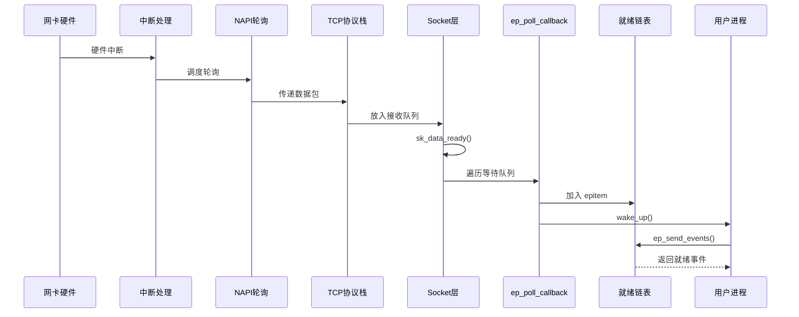

前几章我们从应用层和系统调用层面学习了 epoll。但要真正理解 epoll 的威力，我们需要深入内核，看看这套机制是如何精心设计的。

## 为什么要读内核源码

你可能会问：作为应用开发者，了解系统调用的用法不就够了吗？为什么要深入内核呢？

这就像学开车和学汽车原理的区别。你当然可以只学会踩油门和刹车，但当车出了问题，或者你想把车开到极限性能时，不了解发动机原理就会束手无策。

读 epoll 内核源码的实际价值：

**1. 性能调优有的放矢**

当你的服务器遇到瓶颈时，了解内核实现能让你知道问题在哪里。比如，为什么在某些场景下性能突然下降？是红黑树操作的开销，还是就绪链表遍历的问题？内核源码会告诉你答案。

**2. 奇怪的 bug 不再神秘**

"为什么我的事件丢了？"、"为什么收到了重复的通知？"——这些问题在理解内核实现后往往豁然开朗。边缘触发和水平触发的差异，不只是文档上的几句话，而是内核中几行代码的差别。

**3. 设计新系统时有参照**

Linux 内核是世界顶尖工程师几十年的智慧结晶。epoll 的设计——红黑树管理、回调驱动、就绪链表——都是经过深思熟虑的选择。理解这些设计，对于你自己设计高性能系统大有裨益。

本章基于 Linux 5.15 内核源码分析。虽然不同版本有差异，但核心设计思想是一脉相承的。

## 内核源码的组织结构

在深入具体实现之前，我们先了解一下 epoll 相关代码在内核中是如何组织的。

```bash
# epoll 的核心实现
fs/eventpoll.c           # 主要实现（约 2500 行）
include/linux/eventpoll.h  # 数据结构定义

# 网络子系统（与 epoll 回调相关）
net/core/sock.c            # socket 核心实现
net/ipv4/tcp.c           # TCP 协议实现

# 网卡驱动（事件的起点）
drivers/net/ethernet/...  # 各种网卡驱动
net/core/dev.c            # 网络设备核心
```

你会发现 epoll 的代码放在 `fs/` 目录下，而不是 `net/` 目录。这是因为 epoll 本质上是一个文件系统操作——它通过一个特殊的文件描述符来管理其他文件描述符。这种设计让 epoll 不仅能监控网络连接，还能监控任何支持 poll 操作的文件（管道、设备文件等）。

## 核心数据结构：epoll 的骨架

理解 epoll 的关键是理解它的三个核心数据结构，它们就像一个精密机械的三个齿轮，相互咬合、协同工作。

### eventpoll：指挥中心

`eventpoll` 结构体是整个 epoll 实例的指挥中心，每次调用 `epoll_create1()` 都会创建一个这样的对象。

```c
// include/linux/eventpoll.h

struct eventpoll {
    // ========== 文件描述符管理 ==========
    // 红黑树根节点，管理所有监听的文件描述符
    struct rb_root_cached rbr;

    // ========== 就绪事件管理 ==========
    // 就绪链表，存储有事件的文件描述符
    struct list_head rdllist;
    // 溢出链表，用于处理并发情况
    struct list_head ovflist;

    // ========== 进程等待管理 ==========
    // 等待队列，存放调用 epoll_wait 的进程
    wait_queue_head_t wq;
    // 用于 epoll 嵌套场景的等待队列
    wait_queue_head_t poll_wait;

    // ========== 同步保护 ==========
    // 保护就绪链表的自旋锁
    spinlock_t lock;
    // 保护整个结构的互斥锁
    struct mutex mtx;

    // ========== 统计与资源 ==========
    // 当前活跃的文件描述符数量
    int nfds;
    // 关联的匿名文件
    struct file *file;
    // 所属用户（用于资源限制）
    struct user_struct *user;
};
```

让我来解释这些字段的设计意图：

**红黑树（rbr）**：为什么选择红黑树？

想象你管理着 10 万个连接。当需要修改或删除某个连接的监听事件时，你需要先找到它。如果用数组或链表，查找时间是 O(n)——10 万个连接意味着可能要遍历 10 万次。而红黑树的查找时间是 O(log n)，10 万个连接只需要约 17 次比较。

红黑树是一种自平衡的二叉搜索树，它保证了最坏情况下的性能。AVL 树虽然平衡更严格，但插入删除时的旋转操作更多。红黑树在查找和修改之间取得了很好的平衡，这正是 epoll 需要的——既要频繁查找，又要频繁增删。

**就绪链表（rdllist）**：为什么用双向链表？

就绪链表存放的是"有事件发生"的文件描述符。每次 `epoll_wait` 返回时，只需要遍历这个链表，而不是所有 10 万个连接。

为什么是双向链表而不是单向链表？因为我们需要 O(1) 时间从链表中间删除节点。当一个事件被处理后（尤其是边缘触发模式），需要把它从就绪链表移除。双向链表让这个操作只需要修改前后节点的指针，而单向链表需要先遍历找到前驱节点。

**两把锁的分工**

`spinlock_t lock` 是自旋锁，用于保护就绪链表。自旋锁的特点是在锁竞争时不会让进程睡眠，而是不断循环检查。这适合保护访问时间很短的临界区——往就绪链表加入或删除一个节点只需要几个指针操作。

`struct mutex mtx` 是互斥锁，用于保护整个 epoll 实例的操作（比如添加新的文件描述符）。互斥锁在锁竞争时会让进程睡眠，适合保护耗时较长的操作。

### epitem：文件描述符的代言人

每个被 epoll 监控的文件描述符，在内核中都有一个 `epitem` 结构体作为它的"代言人"。

```c
// fs/eventpoll.c

struct epitem {
    // ========== 红黑树相关 ==========
    // 红黑树节点，用于挂在 eventpoll.rbr 上
    struct rb_node rbn;

    // ========== 就绪链表相关 ==========
    // 链表节点，用于挂在 eventpoll.rdllist 上
    struct list_head rdllink;
    // 下一个溢出的 epitem
    struct epitem *next;

    // ========== 关联信息 ==========
    // 所属的 eventpoll
    struct eventpoll *ep;
    // 监控的目标文件
    struct file *ffd;
    // 文件描述符编号
    int fd;

    // ========== 事件信息 ==========
    // 用户关心的事件和数据
    struct epoll_event event;
    // 实际发生的事件
    __poll_t revents;

    // ========== 回调机制相关 ==========
    // 等待队列条目链表
    struct eppoll_entry *pwqlist;

    // ========== 独占模式相关 ==========
    // 独占模式链表节点
    struct hlist_node fllink;
};
```

注意 `epitem` 同时包含了红黑树节点（rbn）和链表节点（rdllink）。这意味着同一个 `epitem`：

- 通过 `rbn` 挂在红黑树上，方便按 fd 快速查找
- 当有事件发生时，通过 `rdllink` 挂到就绪链表上

这种设计避免了额外的内存分配和指针查找。

### eppoll_entry：回调的桥梁

`eppoll_entry` 是 epoll 回调机制的关键，它连接了"被监控的文件"和"epoll 实例"。

```c
// fs/eventpoll.c

struct eppoll_entry {
    // 链表节点，用于挂在 epitem.pwqlist 上
    struct list_head llink;

    // 等待队列条目
    wait_queue_entry_t wait;

    // 关联的 epitem
    struct epitem *base;

    // 目标文件的等待队列头
    wait_queue_head_t *whead;
};
```

这个结构体的作用是：当被监控的文件有事件发生时，通过 `wait` 中注册的回调函数，找到对应的 `epitem`，进而更新 epoll 的就绪链表。

我们稍后会详细分析这个回调机制是如何工作的。

## epoll_create1：创建指挥中心

理解了数据结构，我们来看系统调用的实现。先从 `epoll_create1` 开始。

### 系统调用入口

```c
// fs/eventpoll.c

SYSCALL_DEFINE1(epoll_create1, int, flags)
{
    // flags 只能是 0 或 EPOLL_CLOEXEC
    // EPOLL_CLOEXEC 表示 exec 时自动关闭这个 fd
    if (flags & ~EPOLL_CLOEXEC)
        return -EINVAL;

    return do_epoll_create(flags);
}
```

`SYSCALL_DEFINE1` 是一个宏，展开后会生成系统调用的入口函数。这里的参数检查很简单：只接受 `EPOLL_CLOEXEC` 标志。

### 核心创建逻辑

```c
static int do_epoll_create(int flags)
{
    int error, fd;
    struct eventpoll *ep = NULL;
    struct file *file;

    // 第一步：分配并初始化 eventpoll 对象
    error = ep_alloc(&ep);
    if (error < 0)
        return error;

    // 第二步：获取一个未使用的文件描述符
    fd = get_unused_fd_flags(O_RDWR | (flags & O_CLOEXEC));
    if (fd < 0) {
        error = fd;
        goto out_free_ep;
    }

    // 第三步：创建一个匿名文件（anon inode）
    // "[eventpoll]" 是在 /proc/pid/fd/ 中显示的名字
    file = anon_inode_getfile("[eventpoll]", &eventpoll_fops, ep,
                              O_RDWR | (flags & O_CLOEXEC));
    if (IS_ERR(file)) {
        error = PTR_ERR(file);
        goto out_free_fd;
    }

    // 建立双向关联
    ep->file = file;

    // 第四步：将文件描述符和 file 对象关联
    fd_install(fd, file);

    return fd;

out_free_fd:
    put_unused_fd(fd);
out_free_ep:
    ep_free(ep);
    return error;
}
```

这里有几个值得注意的设计：

**匿名 inode（anon_inode）**

epoll 文件描述符是一个"匿名 inode"，它不对应磁盘上的任何文件。这是 Linux 内核中一种轻量级的文件抽象，常用于创建各种特殊的文件描述符（epoll、eventfd、timerfd 等）。

当你在 `/proc/<pid>/fd/` 目录下查看进程的文件描述符时，会看到类似这样的输出：

```bash
$ ls -l /proc/1234/fd/
lrwx------ 1 user user 64 Jan  1 00:00 3 -> anon_inode:[eventpoll]
```

**文件操作函数表（eventpoll_fops）**

`eventpoll_fops` 定义了 epoll 文件支持的操作：

```c
static const struct file_operations eventpoll_fops = {
    .show_fdinfo    = ep_show_fdinfo,  // 显示在 /proc/pid/fdinfo 中的信息
    .release        = ep_eventpoll_release,  // 关闭时释放资源
    .poll           = ep_eventpoll_poll,     // 支持被其他 epoll 监控
    .llseek         = noop_llseek,
};
```

是的，epoll 本身也可以被另一个 epoll 监控！这就是 epoll 嵌套的能力。

### eventpoll 的初始化

```c
static int ep_alloc(struct eventpoll **pep)
{
    struct eventpoll *ep;

    // 分配内存并清零
    ep = kzalloc(sizeof(*ep), GFP_KERNEL);
    if (!ep)
        return -ENOMEM;

    // 初始化互斥锁
    mutex_init(&ep->mtx);

    // 初始化读写信号量（用于保护红黑树）
    rwlock_init(&ep->lock);

    // 初始化等待队列
    init_waitqueue_head(&ep->wq);
    init_waitqueue_head(&ep->poll_wait);

    // 初始化就绪链表
    INIT_LIST_HEAD(&ep->rdllist);

    // 初始化红黑树（空树）
    ep->rbr = RB_ROOT_CACHED;

    // 初始化溢出链表（标记为未激活）
    ep->ovflist = EP_UNACTIVE_PTR;

    // 保存当前用户信息（用于资源限制）
    ep->user = get_current_user();

    *pep = ep;
    return 0;
}
```

此时，一个空的 epoll 实例就创建好了。红黑树是空的，就绪链表也是空的，等待用户通过 `epoll_ctl` 添加文件描述符。

## epoll_ctl：管理监控列表

`epoll_ctl` 是 epoll 的"管理员"接口，负责添加、修改和删除被监控的文件描述符。

### 系统调用入口

```c
SYSCALL_DEFINE4(epoll_ctl, int, epfd, int, op, int, fd,
                struct epoll_event __user *, event)
{
    struct eventpoll *ep;
    struct epitem *epi;
    struct epoll_event epds;
    struct file *file, *tfile;
    int error;

    // 第一步：获取 epoll 实例
    file = fget(epfd);
    if (!file)
        return -EBADF;

    // 检查是否是 epoll 文件
    if (!is_file_epoll(file)) {
        error = -EINVAL;
        goto error_fput;
    }
    ep = file->private_data;

    // 第二步：获取目标文件
    tfile = fget(fd);
    if (!tfile) {
        error = -EBADF;
        goto error_fput;
    }

    // 检查目标文件是否支持 poll 操作
    if (!file_can_poll(tfile)) {
        error = -EPERM;
        goto error_tgt_fput;
    }

    // 第三步：从用户空间复制事件结构
    if (ep_op_has_event(op) &&
        copy_from_user(&epds, event, sizeof(struct epoll_event))) {
        error = -EFAULT;
        goto error_tgt_fput;
    }

    // 检查是否试图把 epoll 自己加入监控（会导致死锁）
    if (epfd == fd) {
        error = -EINVAL;
        goto error_tgt_fput;
    }

    // 第四步：根据操作类型处理
    mutex_lock(&ep->mtx);

    // 在红黑树中查找是否已存在
    epi = ep_find(ep, tfile, fd);

    switch (op) {
    case EPOLL_CTL_ADD:
        if (!epi) {
            // 不存在，添加新的
            epds.events |= EPOLLERR | EPOLLHUP;  // 这两个事件总是监控
            error = ep_insert(ep, &epds, tfile, fd);
        } else {
            error = -EEXIST;
        }
        break;

    case EPOLL_CTL_DEL:
        if (epi) {
            error = ep_remove(ep, epi);
        } else {
            error = -ENOENT;
        }
        break;

    case EPOLL_CTL_MOD:
        if (epi) {
            epds.events |= EPOLLERR | EPOLLHUP;
            error = ep_modify(ep, epi, &epds);
        } else {
            error = -ENOENT;
        }
        break;

    default:
        error = -EINVAL;
    }

    mutex_unlock(&ep->mtx);

error_tgt_fput:
    fput(tfile);
error_fput:
    fput(file);

    return error;
}
```

有几个重要的细节：

**总是监控 EPOLLERR 和 EPOLLHUP**

不管用户有没有请求，这两个事件总是会被监控。`EPOLLERR` 表示发生错误，`EPOLLHUP` 表示对端关闭连接。这是合理的——你肯定想知道连接出了问题。

**不能监控自己**

如果把 epoll 文件描述符加入自己的监控列表，在检查就绪状态时会形成死锁。内核在这里做了检查。

### ep_insert：添加新文件描述符

这是 `epoll_ctl` 最复杂也最重要的操作。它不仅要创建数据结构，还要设置回调机制。

```c
static int ep_insert(struct eventpoll *ep, const struct epoll_event *event,
                     struct file *tfile, int fd)
{
    int error, pwake = 0;
    __poll_t revents;
    struct epitem *epi;
    struct ep_pqueue epq;

    // 第一步：检查资源限制
    // 每个用户能监控的文件描述符数量是有限制的
    if (unlikely(percpu_counter_compare(&ep->user->epoll_watches,
                                        max_user_watches) >= 0))
        return -ENOSPC;

    // 第二步：分配 epitem 结构
    epi = kmem_cache_zalloc(epi_cache, GFP_KERNEL);
    if (unlikely(!epi))
        return -ENOMEM;

    // 第三步：初始化 epitem
    INIT_LIST_HEAD(&epi->rdllink);
    epi->ep = ep;
    ep_set_ffd(&epi->ffd, tfile, fd);
    epi->event = *event;
    epi->next = EP_UNACTIVE_PTR;

    // 第四步：设置回调机制（这是核心！）
    epq.epi = epi;
    init_poll_funcptr(&epq.pt, ep_ptable_queue_proc);

    // 调用目标文件的 poll 方法
    // 这会触发 ep_ptable_queue_proc 回调，注册我们的等待队列条目
    revents = ep_item_poll(epi, &epq.pt, 1);

    // 第五步：插入红黑树
    ep_rbtree_insert(ep, epi);

    // 第六步：如果已经有事件就绪，加入就绪链表
    if (revents && !ep_is_linked(epi)) {
        list_add_tail(&epi->rdllink, &ep->rdllist);

        // 如果有进程在等待，唤醒它
        if (waitqueue_active(&ep->wq))
            wake_up(&ep->wq);

        // 如果有其他 epoll 在监控我们，通知它
        if (waitqueue_active(&ep->poll_wait))
            pwake++;
    }

    // 更新计数
    percpu_counter_inc(&ep->user->epoll_watches);

    // 唤醒监控我们的 epoll
    if (pwake)
        ep_poll_safewake(ep, NULL);

    return 0;
}
```

这里最关键的是第四步——设置回调机制。让我们深入理解这个过程。

### 回调注册：ep_ptable_queue_proc

当调用 `ep_item_poll` 时，目标文件的 poll 实现会调用我们传入的 `ep_ptable_queue_proc` 函数。这个函数负责将 epoll 的回调"注入"到目标文件的等待队列中。

```c
static void ep_ptable_queue_proc(struct file *file, wait_queue_head_t *whead,
                                  poll_table *pt)
{
    struct ep_pqueue *epq = container_of(pt, struct ep_pqueue, pt);
    struct epitem *epi = epq->epi;
    struct eppoll_entry *pwq;

    // 分配等待队列条目
    pwq = kmem_cache_alloc(pwq_cache, GFP_KERNEL);
    if (unlikely(!pwq)) {
        epq->epi = NULL;
        return;
    }

    // 设置回调函数为 ep_poll_callback
    init_waitqueue_func_entry(&pwq->wait, ep_poll_callback);

    // 建立关联
    pwq->whead = whead;
    pwq->base = epi;

    // 将我们的等待队列条目添加到目标文件的等待队列
    // 当文件有事件时，会遍历这个等待队列，调用每个条目的回调函数
    add_wait_queue(whead, &pwq->wait);

    // 保存到 epitem，方便后续删除
    pwq->llink.next = epi->pwqlist;
    epi->pwqlist = pwq;
}
```

这个过程可以用一个比喻来理解：

想象你订阅了一份报纸。报社（目标文件）有一个订阅者列表（等待队列）。你去报社登记（`add_wait_queue`），留下你的地址和"送报上门"的指令（`ep_poll_callback`）。以后每次报纸出版（有事件），报社就会按照订阅者列表，逐个上门送报（调用回调函数）。

### 红黑树插入

```c
static void ep_rbtree_insert(struct eventpoll *ep, struct epitem *epi)
{
    int kcmp;
    struct rb_node **p = &ep->rbr.rb_root.rb_node;
    struct rb_node *parent = NULL;
    struct epitem *epic;

    // 标准的二叉搜索树插入过程
    while (*p) {
        parent = *p;
        epic = rb_entry(parent, struct epitem, rbn);

        // 比较文件描述符
        kcmp = ep_cmp_ffd(&epi->ffd, &epic->ffd);

        if (kcmp > 0)
            p = &parent->rb_right;
        else
            p = &parent->rb_left;
    }

    // 插入节点
    rb_link_node(&epi->rbn, parent, p);

    // 调整红黑树平衡
    rb_insert_color_cached(&epi->rbn, &ep->rbr, leftmost);
}
```

红黑树插入后会自动进行旋转和重新着色，保证树的高度始终是 O(log n)。

## 回调机制：epoll 高效的秘密

现在我们来看 epoll 最精妙的设计——回调机制。这是 epoll 性能远超 select/poll 的关键所在。

### 传统 poll 的问题

在没有 epoll 之前，`select` 和 `poll` 是这样工作的：

```
用户态                              内核态
  |                                   |
  | -- select(fds) -->               |
  |                                   | 遍历所有 fd
  |                                   | 检查每个 fd 的状态
  |                                   | 如果都没就绪，sleep
  |                                   | ... 某个 fd 就绪 ...
  |                                   | 再次遍历所有 fd
  |                                   | 收集就绪的 fd
  | <-- 返回就绪 fd --                |
```

问题在于：每次调用都要遍历**所有**文件描述符，时间复杂度是 O(n)。当你有 10 万个连接，但每次只有几个就绪时，这种遍历就是巨大的浪费。

### epoll 的回调驱动

epoll 彻底改变了这种模式：

```
用户态                              内核态
  |                                   |
  | -- epoll_wait -->                |
  |                                   | 检查就绪链表
  |                                   | 为空？sleep
  |                                   |
  |           （某处网卡收到数据）      |
  |                                   | 中断处理
  |                                   | 数据到达 socket
  |                                   | socket 调用回调函数
  |                                   | 回调函数把 fd 加入就绪链表
  |                                   | 唤醒 epoll_wait
  |                                   |
  |                                   | 只遍历就绪链表
  | <-- 返回就绪 fd --                |
```

关键差异：epoll 不主动轮询，而是**被动接收通知**。当文件描述符有事件时，它会主动告诉 epoll。这就是"回调驱动"的含义。

### ep_poll_callback：回调函数

当被监控的文件有事件发生时，这个函数会被调用：

```c
static int ep_poll_callback(wait_queue_entry_t *wait, unsigned mode,
                             int sync, void *key)
{
    int pwake = 0;
    struct epitem *epi = ep_item_from_wait(wait);
    struct eventpoll *ep = epi->ep;
    __poll_t pollflags = key_to_poll(key);
    unsigned long flags;
    int ewake = 0;

    // 检查是否是我们关心的事件
    if (pollflags && !(pollflags & epi->event.events))
        goto out_unlock;

    // 获取自旋锁，保护就绪链表
    read_lock_irqsave(&ep->lock, flags);

    // 如果正在发送事件，使用溢出链表
    // 这是为了避免在遍历就绪链表时修改它
    if (unlikely(ep->ovflist != EP_UNACTIVE_PTR)) {
        if (epi->next == EP_UNACTIVE_PTR) {
            epi->next = ep->ovflist;
            ep->ovflist = epi;
        }
        goto out_unlock;
    }

    // 如果还没在就绪链表中，加入
    if (!ep_is_linked(epi)) {
        list_add_tail(&epi->rdllink, &ep->rdllist);
        ewake = 1;
    }

    // 唤醒等待的进程
    if (waitqueue_active(&ep->wq)) {
        // 对于 EXCLUSIVE 模式，只唤醒一个进程
        if ((epi->event.events & EPOLLEXCLUSIVE) &&
            !(pollflags & POLLFREE)) {
            switch (pollflags & EPOLLINOUT_BITS) {
            case EPOLLIN:
                if (epi->event.events & EPOLLIN)
                    ewake = 1;
                break;
            case EPOLLOUT:
                if (epi->event.events & EPOLLOUT)
                    ewake = 1;
                break;
            case 0:
                ewake = 1;
                break;
            }
        }
        wake_up(&ep->wq);
    }

out_unlock:
    read_unlock_irqrestore(&ep->lock, flags);

    // 如果有其他 epoll 监控我们，也通知它们
    if (pwake)
        ep_poll_safewake(ep, epi);

    return ewake;
}
```

这个函数的核心逻辑：

1. **过滤事件**：只处理用户关心的事件类型
2. **加入就绪链表**：把 `epitem` 加到 `rdllist` 尾部
3. **唤醒进程**：通知在 `epoll_wait` 中睡眠的进程

注意这里使用的是**自旋锁**（`read_lock_irqsave`），而且是"中断安全"版本。因为这个回调可能在中断上下文中被调用（网卡收到数据时），不能使用会导致睡眠的锁。

### 溢出链表的妙用

当 `epoll_wait` 正在遍历就绪链表、向用户空间复制事件时，可能有新的事件到来。如果直接修改就绪链表，可能导致遍历出错。

解决方案是使用**溢出链表**（ovflist）：

```c
// 在 ep_send_events 开始时
ep->ovflist = NULL;  // 激活溢出链表

// 遍历就绪链表...

// 在 ep_send_events 结束时，将溢出链表合并回就绪链表
for (nepi = ep->ovflist; nepi != EP_UNACTIVE_PTR; nepi = next) {
    next = nepi->next;
    nepi->next = EP_UNACTIVE_PTR;

    if (!ep_is_linked(nepi))
        list_add_tail(&nepi->rdllink, &ep->rdllist);
}
ep->ovflist = EP_UNACTIVE_PTR;  // 禁用溢出链表
```

这是一种典型的"无锁"技术——通过数据结构的设计避免竞争，而不是用锁来串行化访问。

## 完整的事件流：从网卡到用户空间

现在让我们把整个调用链串起来，看看一个网络数据包是如何一步步变成 `epoll_wait` 返回值的。

### 第一步：硬件中断

当网卡收到数据包时，会触发硬件中断：

```c
// drivers/net/ethernet/intel/e1000/e1000_main.c（以 Intel e1000 网卡为例）

static irqreturn_t e1000_intr(int irq, void *data)
{
    struct net_device *netdev = data;
    struct e1000_adapter *adapter = netdev_priv(netdev);

    // 读取中断状态寄存器
    u32 icr = er32(ICR);

    // 检查是否是接收中断
    if (icr & E1000_ICR_RXT0) {
        // 不在中断中处理，而是调度 NAPI 轮询
        if (likely(napi_schedule_prep(&adapter->napi)))
            __napi_schedule(&adapter->napi);
    }

    return IRQ_HANDLED;
}
```

注意这里使用了 NAPI（New API），它是 Linux 网络子系统的一个优化。在高负载时，不为每个数据包都触发中断，而是使用轮询模式批量处理，大大降低了中断开销。

### 第二步：NAPI 轮询

```c
static int e1000_poll(struct napi_struct *napi, int budget)
{
    struct e1000_adapter *adapter = container_of(napi, struct e1000_adapter, napi);
    int work_done;

    // 批量处理数据包
    work_done = e1000_clean_rx_irq(adapter, budget);

    // 如果处理完了所有数据包，退出轮询模式
    if (work_done < budget) {
        napi_complete_done(napi, work_done);
        // 重新启用中断
        e1000_irq_enable(adapter);
    }

    return work_done;
}
```

### 第三步：数据包进入协议栈

```c
static bool e1000_clean_rx_irq(struct e1000_adapter *adapter, int budget)
{
    struct sk_buff *skb;

    // 从 DMA 环形缓冲区获取数据
    skb = e1000_alloc_rx_skb(adapter);

    // 填充 skb 元数据
    skb->protocol = eth_type_trans(skb, netdev);

    // 将数据包传递给网络协议栈
    // 这会触发 IP -> TCP 的处理链
    napi_gro_receive(&adapter->napi, skb);

    return true;
}
```

### 第四步：TCP 处理

```c
// net/ipv4/tcp_ipv4.c

int tcp_v4_rcv(struct sk_buff *skb)
{
    const struct tcphdr *th;
    struct sock *sk;

    // 解析 TCP 头
    th = tcp_hdr(skb);

    // 查找对应的 socket
    sk = __inet_lookup_skb(&tcp_hashinfo, skb,
                           th->source, th->dest);

    if (sk) {
        // 找到了对应的连接，处理数据
        ret = tcp_v4_do_rcv(sk, skb);
    }

    return ret;
}
```

### 第五步：数据进入接收队列

```c
// net/ipv4/tcp_input.c

int tcp_rcv_established(struct sock *sk, struct sk_buff *skb)
{
    struct tcp_sock *tp = tcp_sk(sk);

    // 将数据放入接收队列
    __skb_queue_tail(&sk->sk_receive_queue, skb);

    // 更新接收窗口
    tcp_rcv_space_adjust(sk);

    // 关键！通知等待者：有数据可读了
    sk->sk_data_ready(sk);

    return 0;
}
```

### 第六步：触发 epoll 回调

`sk->sk_data_ready` 是一个函数指针，默认实现是：

```c
// net/core/sock.c

void sock_def_readable(struct sock *sk)
{
    struct socket_wq *wq;

    rcu_read_lock();
    wq = rcu_dereference(sk->sk_wq);

    // 如果有等待者，唤醒它们
    if (skwq_has_sleeper(wq))
        wake_up_interruptible_sync_poll(&wq->wait,
                                        EPOLLIN | EPOLLPRI | EPOLLRDNORM);

    rcu_read_unlock();
}
```

`wake_up_interruptible_sync_poll` 会遍历等待队列，调用每个等待者的回调函数。这就会调用到我们之前注册的 `ep_poll_callback`！

### 完整调用链图



整个过程中，**没有任何轮询**。数据包从网卡到用户空间，完全是通过回调和唤醒机制驱动的。这就是 epoll 能处理海量连接的秘密。

## epoll_wait：收获就绪事件

最后，让我们看看 `epoll_wait` 是如何返回就绪事件的。

### 系统调用入口

```c
SYSCALL_DEFINE4(epoll_wait, int, epfd, struct epoll_event __user *, events,
                int, maxevents, int, timeout)
{
    struct timespec64 to;

    // 参数检查
    if (maxevents <= 0 || maxevents > EP_MAX_EVENTS)
        return -EINVAL;

    // 转换超时时间
    if (timeout >= 0) {
        to = ns_to_timespec64((s64)timeout * NSEC_PER_MSEC);
    }

    return do_epoll_wait(epfd, events, maxevents,
                         timeout >= 0 ? &to : NULL);
}
```

### 核心等待逻辑

```c
static int do_epoll_wait(int epfd, struct epoll_event __user *events,
                         int maxevents, struct timespec64 *timeout)
{
    struct eventpoll *ep;
    struct file *file;
    int error;

    // 获取 epoll 实例
    file = fget(epfd);
    ep = file->private_data;

    // 调用核心等待函数
    error = ep_poll(ep, events, maxevents, timeout);

    fput(file);
    return error;
}

static int ep_poll(struct eventpoll *ep, struct epoll_event __user *events,
                   int maxevents, struct timespec64 *timeout)
{
    int res, eavail, timed_out = 0;
    u64 slack = 0;
    wait_queue_entry_t wait;
    ktime_t expires, *to = NULL;

    // 如果设置了超时，计算精确的过期时间
    if (timeout) {
        slack = select_estimate_accuracy(timeout);
        to = &expires;
        *to = timespec64_to_ktime(*timeout);
    }

retry:
    // 先检查就绪链表
    eavail = ep_events_available(ep);

    // 如果没有就绪事件且需要等待
    if (!eavail) {
        // 超时为 0 表示不等待
        if (timeout && !timespec64_valid(timeout)) {
            timed_out = 1;
            goto send_events;
        }

        // 初始化等待队列条目
        init_wait(&wait);
        wait.func = default_wake_function;

        // 设置进程状态为可中断睡眠
        set_current_state(TASK_INTERRUPTIBLE);

        // 加入 epoll 的等待队列
        __add_wait_queue_exclusive(&ep->wq, &wait);

        for (;;) {
            // 再次检查是否有事件（防止竞争）
            eavail = ep_events_available(ep);
            if (eavail)
                break;

            // 检查是否收到信号
            if (signal_pending(current)) {
                res = -EINTR;
                break;
            }

            // 睡眠，等待超时或被唤醒
            if (!schedule_hrtimeout_range(to, slack, HRTIMER_MODE_ABS)) {
                timed_out = 1;
                break;
            }
        }

        // 从等待队列移除
        __remove_wait_queue(&ep->wq, &wait);
        __set_current_state(TASK_RUNNING);
    }

send_events:
    // 如果有就绪事件，发送到用户空间
    if (eavail && !res)
        res = ep_send_events(ep, events, maxevents);

    return res;
}
```

这里的等待逻辑很精妙：

1. **先检查后等待**：避免在已有事件时还去睡眠
2. **使用 TASK_INTERRUPTIBLE**：可以被信号中断，比如 Ctrl+C
3. **使用独占等待**：`__add_wait_queue_exclusive` 保证多个进程等待时，只唤醒一个（配合 EPOLLEXCLUSIVE）
4. **循环检查**：被唤醒后再次检查，防止虚假唤醒

### 发送事件到用户空间

```c
static int ep_send_events(struct eventpoll *ep,
                          struct epoll_event __user *events, int maxevents)
{
    struct epitem *epi, *tmp;
    LIST_HEAD(txlist);
    poll_table pt;
    int res = 0;

    // 激活溢出链表
    ep->ovflist = NULL;

    // 遍历就绪链表
    list_for_each_entry_safe(epi, tmp, &ep->rdllist, rdllink) {
        // 边缘触发模式：从就绪链表移除
        // 水平触发模式：保留在就绪链表
        if (epi->event.events & EPOLLET)
            list_del_init(&epi->rdllink);

        // 再次检查事件状态（可能已经被处理）
        __poll_t revents = ep_item_poll(epi, &pt, 0);
        if (!revents)
            continue;

        // 拷贝事件到用户空间
        if (__put_user(revents, &events[res].events) ||
            __put_user(epi->event.data, &events[res].data)) {
            list_add(&epi->rdllink, &ep->rdllist);
            break;
        }

        res++;

        // ONESHOT 模式：禁用此事件
        if (epi->event.events & EPOLLONESHOT)
            epi->event.events &= EP_PRIVATE_BITS;

        // 达到用户请求的最大数量
        if (res >= maxevents)
            break;
    }

    // 处理溢出链表
    // ...（之前讨论过的代码）

    return res;
}
```

这里有两个重要的行为差异：

**边缘触发（ET）vs 水平触发（LT）**

- **LT 模式**：`epitem` 保留在就绪链表。如果用户没有完全处理事件（比如没有读完所有数据），下次 `epoll_wait` 还会返回这个 fd。
- **ET 模式**：`epitem` 从就绪链表移除。不管用户是否处理完，只有**新的事件**到来时才会再次通知。

这就是为什么 ET 模式必须配合非阻塞 IO 和循环读取使用——如果一次没读完就不读了，下次不会再通知你。

**ONESHOT 模式**

ONESHOT 模式下，事件被报告一次后就会被禁用（`events` 被清除）。用户必须用 `epoll_ctl(EPOLL_CTL_MOD)` 重新启用。这对于多线程环境很有用，可以确保同一个事件不会被多个线程同时处理。

## 性能特征总结

经过深入分析，我们可以清楚地看到 epoll 的性能特征：

### 时间复杂度

| 操作 | 复杂度 | 说明 |
|------|--------|------|
| epoll_create1 | O(1) | 创建数据结构 |
| epoll_ctl ADD | O(log n) | 红黑树插入 + 回调注册 |
| epoll_ctl DEL | O(log n) | 红黑树删除 + 回调注销 |
| epoll_ctl MOD | O(log n) | 红黑树查找 + 修改 |
| epoll_wait | O(k) | k 是就绪的 fd 数量 |
| 事件到达 | O(1) | 加入就绪链表 |

关键点：`epoll_wait` 的复杂度与**总连接数无关**，只与**就绪连接数**有关。这就是 epoll 能处理 C10K（1 万连接）甚至 C1M（100 万连接）的原因。

### 空间复杂度

每个被监控的 fd 需要：
- 1 个 `epitem` 结构体
- 1 个或多个 `eppoll_entry` 结构体（取决于目标文件）

在 64 位系统上，大约每个 fd 占用 200-300 字节。100 万连接需要约 200-300 MB 内存，完全可以接受。

### 与 select/poll 的对比

| 特性 | select/poll | epoll |
|------|------------|-------|
| 每次调用开销 | O(n) 遍历所有 fd | O(k) 只处理就绪 fd |
| fd 数量限制 | select 1024, poll 无限制 | 无限制（受内存限制） |
| 用户态内核态拷贝 | 每次调用都要拷贝 fd 集合 | 只拷贝就绪的事件 |
| 事件通知机制 | 轮询检查 | 回调驱动 |
| 适合场景 | 连接数少，活跃度高 | 连接数多，活跃度低 |

## 调试与观察

了解了 epoll 的内核实现后，让我们看看如何在实际中观察它的行为。

### 使用 /proc 文件系统

```bash
# 查看 epoll 文件描述符的详细信息
cat /proc/<pid>/fdinfo/<epoll_fd>

# 输出示例：
pos:    0
flags:  02
mnt_id: 13
ino:    12345
tfd:        4 events:       19 data: deadbeef00000000  pos:0 ino:67890 sdev:8
tfd:        5 events:       19 data: cafebabe00000000  pos:0 ino:67891 sdev:8
```

每行 `tfd:` 表示一个被监控的文件描述符，显示了它的事件掩码和用户数据。

### 使用 ftrace

```bash
# 启用 epoll 相关的跟踪点
echo 1 > /sys/kernel/debug/tracing/events/syscalls/sys_enter_epoll_wait/enable
echo 1 > /sys/kernel/debug/tracing/events/syscalls/sys_exit_epoll_wait/enable

# 查看跟踪
cat /sys/kernel/debug/tracing/trace_pipe
```

### 使用 bpftrace

```bash
# 统计 epoll_wait 的返回值分布
bpftrace -e 'tracepoint:syscalls:sys_exit_epoll_wait { @ret = hist(args->ret); }'

# 跟踪 epoll_wait 的延迟
bpftrace -e '
tracepoint:syscalls:sys_enter_epoll_wait { @start[tid] = nsecs; }
tracepoint:syscalls:sys_exit_epoll_wait /@start[tid]/ {
    @latency = hist(nsecs - @start[tid]);
    delete(@start[tid]);
}'
```

## 总结

本章我们深入 Linux 内核，探索了 epoll 的实现细节：

**三个核心数据结构**：
- `eventpoll`：指挥中心，管理所有状态
- `epitem`：每个被监控 fd 的代言人
- `eppoll_entry`：回调机制的桥梁

**三个系统调用的实现**：
- `epoll_create1`：创建 eventpoll 对象和匿名文件
- `epoll_ctl`：红黑树管理 + 回调注册
- `epoll_wait`：就绪链表遍历 + 睡眠唤醒

**核心设计思想**：
- 红黑树提供 O(log n) 的 fd 管理
- 就绪链表提供 O(k) 的事件收集（k 是就绪数）
- 回调机制避免了轮询，实现真正的事件驱动
- 溢出链表解决了并发修改问题

理解这些实现细节，不仅能帮助你更好地使用 epoll，还能在遇到性能问题时快速定位原因。更重要的是，这些设计思想——回调驱动、数据结构选择、并发处理——都是你设计高性能系统时可以借鉴的宝贵经验。

下一章，我们将学习如何监控和调试基于 epoll 的应用，包括性能分析工具的使用和常见问题的诊断方法。
