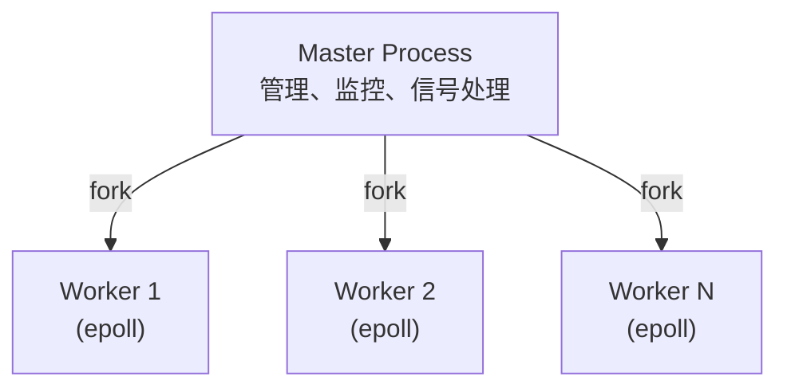
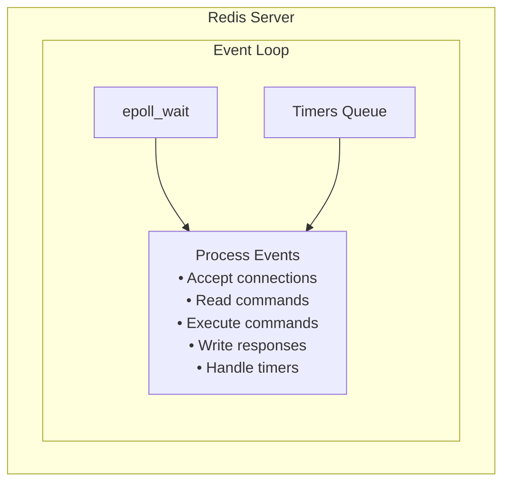
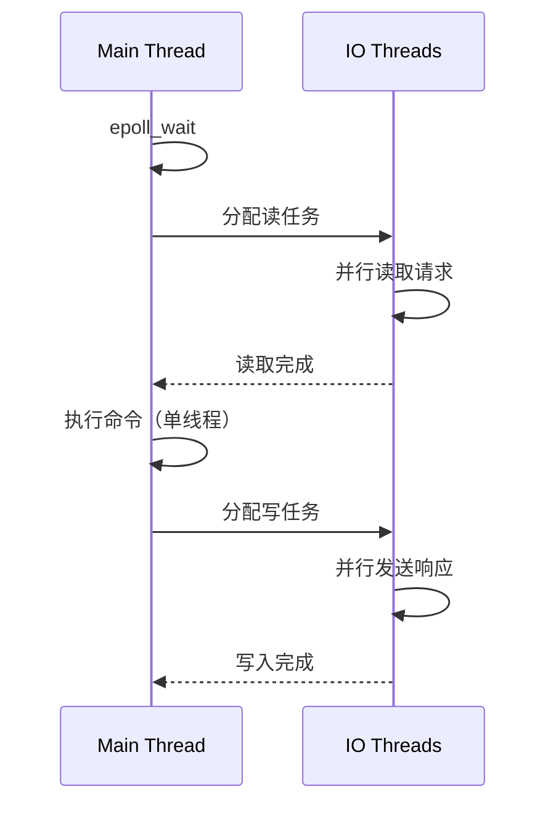
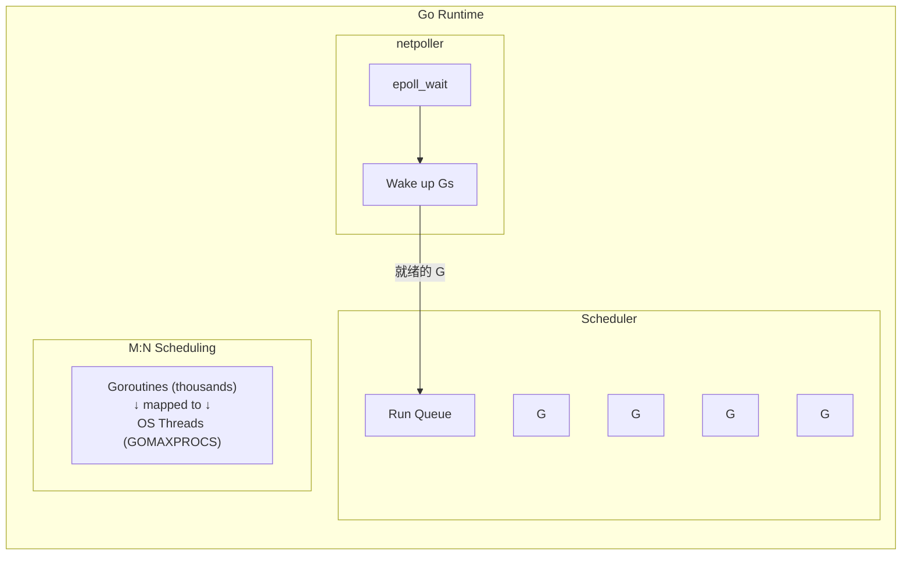
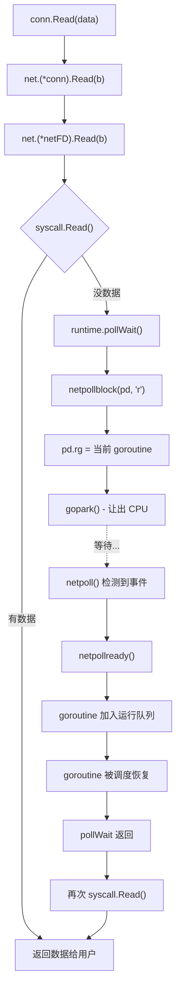

学完原理，最好的巩固方式就是看大师们是怎么做的。这一章，我们将走进三个顶级项目的源码——Nginx、Redis 和 Go runtime，看看它们是如何使用 epoll 的。

这不是简单的"源码阅读"。我们要带着问题去读：
- 为什么选择这种架构？
- 这个设计解决了什么问题？
- 有没有更好的方案？
- 我能从中学到什么？

## Nginx：多进程架构的典范

Nginx 是 HTTP 服务器界的性能标杆，能够轻松处理数万并发连接。它的设计对后来的高性能服务器影响深远。

### 设计哲学：把简单的事情做到极致

Nginx 的创始人 Igor Sysoev 在 2002 年开始开发 Nginx，当时的目标很明确：解决 C10K 问题——如何在一台服务器上处理 1 万个并发连接。

他的设计选择非常务实：

**多进程而非多线程**

当时（2002 年）Linux 的线程实现还不够成熟（NPTL 要到 2003 年才进入主线内核），多线程程序的调试也很困难。相比之下，多进程模型：
- 每个进程独立，一个崩溃不影响其他
- 资源隔离清晰，没有复杂的锁竞争
- 调试简单，用 gdb 就能搞定

**Master-Worker 架构**



Master 进程负责管理工作：
- 读取配置、启动 Worker
- 监控 Worker 状态，挂了就重启
- 处理信号（reload、stop 等）

Worker 进程负责干活：
- 每个 Worker 独立处理请求
- 每个 Worker 有自己的 epoll 实例
- Worker 数量通常等于 CPU 核心数

这种分工让 Nginx 既稳定又高效。

### 源码分析：epoll 的使用

Nginx 的 epoll 实现在 `src/event/modules/ngx_epoll_module.c`，约 800 行代码，非常精炼。

#### 初始化：一切从创建开始

```c
static ngx_int_t
ngx_epoll_init(ngx_cycle_t *cycle, ngx_msec_t timer)
{
    ngx_epoll_conf_t  *epcf;

    epcf = ngx_event_get_conf(cycle->conf_ctx, ngx_epoll_module);

    if (ep == -1) {
        // 创建 epoll 实例
        // 参数是 hint，现代内核已经忽略它了
        ep = epoll_create(cycle->connection_n / 2);

        if (ep == -1) {
            ngx_log_error(NGX_LOG_EMERG, cycle->log, ngx_errno,
                          "epoll_create() failed");
            return NGX_ERROR;
        }
    }

    // 预分配事件数组，避免每次 epoll_wait 都分配
    if (nevents < epcf->events) {
        if (event_list) {
            ngx_free(event_list);
        }

        event_list = ngx_alloc(sizeof(struct epoll_event) * epcf->events,
                               cycle->log);
        if (event_list == NULL) {
            return NGX_ERROR;
        }
    }

    nevents = epcf->events;

    // 设置回调函数
    ngx_event_actions = ngx_epoll_module_ctx.actions;

    return NGX_OK;
}
```

注意这里的小细节：
- `event_list` 是预分配的，避免每次循环都 malloc
- 数组大小是可配置的（`worker_connections` 指令）
- 如果大小变了，会重新分配

#### 添加事件：一个 fd 两种事件

Nginx 的连接结构同时持有读和写两个事件：

```c
struct ngx_connection_s {
    // ...
    ngx_event_t        *read;   // 读事件
    ngx_event_t        *write;  // 写事件
    // ...
};
```

添加事件的逻辑考虑了这种设计：

```c
static ngx_int_t
ngx_epoll_add_event(ngx_event_t *ev, ngx_int_t event, ngx_uint_t flags)
{
    int                  op;
    uint32_t             events, prev;
    ngx_event_t         *e;
    ngx_connection_t    *c;
    struct epoll_event   ee;

    c = ev->data;

    events = (uint32_t) event;

    // 判断这是读事件还是写事件
    if (event == NGX_READ_EVENT) {
        e = c->write;  // 获取另一个事件
        prev = EPOLLOUT;
    } else {
        e = c->read;
        prev = EPOLLIN | EPOLLPRI;
    }

    // 关键：如果另一个事件已经在监控中，用 MOD 而不是 ADD
    if (e->active) {
        op = EPOLL_CTL_MOD;
        events |= prev;  // 保留原来的事件
    } else {
        op = EPOLL_CTL_ADD;
    }

    // 构造 epoll_event
    ee.events = events;
    // 巧妙地利用指针的最低位存储实例标记
    ee.data.ptr = (void *) ((uintptr_t) c | ev->instance);

    if (epoll_ctl(ep, op, c->fd, &ee) == -1) {
        ngx_log_error(NGX_LOG_ALERT, ev->log, ngx_errno,
                      "epoll_ctl(%d, %d) failed", op, c->fd);
        return NGX_ERROR;
    }

    ev->active = 1;
    return NGX_OK;
}
```

这里有两个精妙的设计：

**1. 动态选择 ADD 还是 MOD**

同一个 fd 的读写事件可能分开添加。如果 fd 已经在 epoll 中（另一个事件是 active 的），就用 `EPOLL_CTL_MOD`，否则用 `EPOLL_CTL_ADD`。

这避免了 "fd already in epoll" 的错误，也避免了每次都要先查询 fd 是否已存在。

**2. 指针最低位存储 instance**

`ee.data.ptr` 存储的不只是连接指针，还在最低位塞进了一个 `instance` 标记。这是为了解决"过期事件"问题：

想象这个场景：
1. fd=5 触发事件，epoll_wait 返回
2. 处理 fd=5 的过程中，关闭了这个连接
3. 新连接到来，也分配了 fd=5
4. 继续处理 epoll_wait 返回的事件，但这些事件其实是旧连接的

通过 instance 标记，可以检测到连接是否已经被替换，从而丢弃过期事件。

#### 事件循环：核心中的核心

```c
static ngx_int_t
ngx_epoll_process_events(ngx_cycle_t *cycle, ngx_msec_t timer, ngx_uint_t flags)
{
    int                events;
    uint32_t           revents;
    ngx_int_t          instance, i;
    ngx_event_t       *rev, *wev;
    ngx_connection_t  *c;

    // 调用 epoll_wait，这是唯一可能阻塞的地方
    events = epoll_wait(ep, event_list, (int) nevents, timer);

    // 被信号中断是正常的，比如收到 SIGHUP 重载配置
    if (events == -1) {
        if (ngx_errno == NGX_EINTR) {
            return NGX_OK;
        }
        ngx_log_error(NGX_LOG_ALERT, cycle->log, ngx_errno,
                      "epoll_wait() failed");
        return NGX_ERROR;
    }

    // 超时返回 0，也是正常的
    if (events == 0) {
        if (timer != NGX_TIMER_INFINITE) {
            return NGX_OK;
        }
        // 如果没有设置超时却返回 0，这就奇怪了
        ngx_log_error(NGX_LOG_ALERT, cycle->log, 0,
                      "epoll_wait() returned no events without timeout");
        return NGX_ERROR;
    }

    // 处理每个事件
    for (i = 0; i < events; i++) {
        c = event_list[i].data.ptr;

        // 提取 instance 标记
        instance = (uintptr_t) c & 1;
        c = (ngx_connection_t *) ((uintptr_t) c & (uintptr_t) ~1);

        rev = c->read;

        // 检查是否是过期事件
        if (c->fd == -1 || rev->instance != instance) {
            // 连接已关闭或已被替换，跳过
            continue;
        }

        revents = event_list[i].events;

        // EPOLLERR 和 EPOLLHUP 需要特殊处理
        if (revents & (EPOLLERR|EPOLLHUP)) {
            // 设置 ready 标记，让 handler 能检测到错误
            revents |= EPOLLIN|EPOLLOUT;
        }

        // 处理读事件
        if ((revents & EPOLLIN) && rev->active) {
            rev->ready = 1;
            rev->available = -1;  // 不知道有多少数据可读

            // 调用事件处理器
            // 注意：handler 可能会关闭连接，所以不能在后面继续使用 c
            rev->handler(rev);
        }

        wev = c->write;

        // 处理写事件
        if ((revents & EPOLLOUT) && wev->active) {
            // 再次检查（handler 可能已经关闭连接）
            if (c->fd == -1 || wev->instance != instance) {
                continue;
            }

            wev->ready = 1;
            wev->handler(wev);
        }
    }

    return NGX_OK;
}
```

这段代码展示了几个重要的实践：

**错误和挂起的处理**

`EPOLLERR` 和 `EPOLLHUP` 不能忽略，Nginx 把它们转换成读写就绪事件，让 handler 在下次 read/write 时发现错误。这比单独处理错误事件要简单。

**事件处理顺序**

先处理读，再处理写。这是因为：
- 读事件通常比写事件更重要（请求到了要赶紧处理）
- 读 handler 可能会产生写事件（读完请求要发响应）

**防御性编程**

每次访问 connection 前都要检查它是否还有效。因为事件 handler 可能会关闭连接，而同一个 fd 可能在同一轮 epoll_wait 中有多个事件。

### Nginx 的惊群处理

Nginx 有一个著名的惊群问题解决方案。在早期版本中，它使用 accept mutex：

```c
// 简化版的 accept mutex 实现
if (ngx_accept_mutex) {
    // 尝试获取锁
    if (ngx_trylock_accept_mutex(cycle) == NGX_ERROR) {
        return;
    }

    // 拿到锁的进程才监听 listen socket
    if (ngx_accept_mutex_held) {
        flags |= NGX_POST_EVENTS;  // 延迟处理事件
    } else {
        // 没拿到锁，不监听 listen socket
        // 降低 timer，让下一轮有机会抢锁
        timer = ngx_accept_mutex_delay;
    }
}
```

这个方案有效但不完美：只有一个 Worker 能 accept，浪费了多核能力。

现代 Nginx（1.9.1+）支持 `EPOLLEXCLUSIVE`：

```c
#if (NGX_HAVE_EPOLLEXCLUSIVE)
if (flags & NGX_EXCLUSIVE_EVENT) {
    events |= EPOLLEXCLUSIVE;
}
#endif
```

或者使用 `SO_REUSEPORT`（1.9.1+），让每个 Worker 有独立的 listen socket。

### 从 Nginx 学到什么

1. **预分配优于动态分配**：event_list 是预分配的
2. **一个 fd 一个 epoll 操作**：通过 active 标记避免重复操作
3. **防御性编程**：时刻检查 fd 是否有效
4. **graceful degradation**：错误不要 panic，记录日志继续运行

## Redis：单线程的极限性能

Redis 是另一个 epoll 的经典案例，但它的设计哲学和 Nginx 完全不同。

### 设计哲学：简单就是力量

Redis 的作者 Salvatore Sanfilippo 有一句名言："Redis is probably the most unscalable thing in the world, but it just works."

Redis 选择单线程，不是因为它不能做多线程，而是因为：

**内存操作够快**

Redis 的瓶颈不在 CPU，而在网络和内存带宽。一个 CPU 核心每秒可以执行上亿次内存操作，但网络 IO 的吞吐量有限。单线程足够处理网络 IO 带来的请求。

**简单带来稳定**

没有锁，没有竞争，没有死锁，没有各种多线程 bug。代码简单，bug 就少，维护成本就低。

**可预测的性能**

单线程意味着每个请求的处理时间是可预测的。你不会突然因为锁竞争导致延迟飙升。这对于需要低延迟的场景非常重要。

### 架构概览



整个 Redis 服务器就是一个事件循环，不断地：
1. 调用 epoll_wait 等待网络事件
2. 处理到达的请求
3. 执行定时任务（过期键清理、持久化等）

### 源码分析：极简的 epoll 封装

Redis 的 epoll 封装只有不到 150 行代码，在 `src/ae_epoll.c`。

#### 数据结构

```c
typedef struct aeApiState {
    int epfd;                           // epoll 文件描述符
    struct epoll_event *events;         // 事件数组
} aeApiState;
```

就这么简单。和 Nginx 的复杂封装相比，Redis 的实现极其直白。

#### 创建 epoll

```c
static int aeApiCreate(aeEventLoop *eventLoop) {
    aeApiState *state = zmalloc(sizeof(aeApiState));

    if (!state) return -1;

    // 预分配事件数组
    state->events = zmalloc(sizeof(struct epoll_event)*eventLoop->setsize);
    if (!state->events) {
        zfree(state);
        return -1;
    }

    // 创建 epoll 实例，使用 EPOLL_CLOEXEC
    state->epfd = epoll_create(1024);
    if (state->epfd == -1) {
        zfree(state->events);
        zfree(state);
        return -1;
    }

    eventLoop->apidata = state;
    return 0;
}
```

和 Nginx 一样，事件数组是预分配的。`setsize` 默认是 10128，可以通过 `maxclients` 配置调整。

#### 添加事件

```c
static int aeApiAddEvent(aeEventLoop *eventLoop, int fd, int mask) {
    aeApiState *state = eventLoop->apidata;
    struct epoll_event ee = {0};

    // 判断是 ADD 还是 MOD
    int op = eventLoop->events[fd].mask == AE_NONE ?
            EPOLL_CTL_ADD : EPOLL_CTL_MOD;

    // 组合事件掩码
    ee.events = 0;
    mask |= eventLoop->events[fd].mask;  // 合并已有的事件
    if (mask & AE_READABLE) ee.events |= EPOLLIN;
    if (mask & AE_WRITABLE) ee.events |= EPOLLOUT;
    ee.data.fd = fd;

    if (epoll_ctl(state->epfd, op, fd, &ee) == -1) return -1;
    return 0;
}
```

注意这里 Redis 用了一个技巧：它用 `eventLoop->events[fd].mask` 来追踪每个 fd 当前注册的事件。这样就能知道应该用 ADD 还是 MOD，也能正确合并事件。

这比 Nginx 的方案更简单，但有一个前提：fd 的值必须在 setsize 范围内。对于网络服务器来说，fd 通常从 3 开始顺序分配，这个假设是合理的。

#### 等待事件

```c
static int aeApiPoll(aeEventLoop *eventLoop, struct timeval *tvp) {
    aeApiState *state = eventLoop->apidata;
    int retval, numevents = 0;

    // 计算超时
    int timeout_ms = tvp ? (tvp->tv_sec*1000 + (tvp->tv_usec+999)/1000) : -1;

    // 调用 epoll_wait
    retval = epoll_wait(state->epfd, state->events, eventLoop->setsize,
                        timeout_ms);

    if (retval > 0) {
        numevents = retval;

        // 将 epoll 事件转换为 Redis 事件
        for (int j = 0; j < numevents; j++) {
            int mask = 0;
            struct epoll_event *e = state->events + j;

            if (e->events & EPOLLIN)  mask |= AE_READABLE;
            if (e->events & EPOLLOUT) mask |= AE_WRITABLE;
            if (e->events & EPOLLERR) mask |= AE_WRITABLE | AE_READABLE;
            if (e->events & EPOLLHUP) mask |= AE_WRITABLE | AE_READABLE;

            // 保存到 fired 数组供上层处理
            eventLoop->fired[j].fd = e->data.fd;
            eventLoop->fired[j].mask = mask;
        }
    }
    return numevents;
}
```

这里有个有趣的处理：`EPOLLERR` 和 `EPOLLHUP` 被映射为"可读可写"。这是因为错误和挂起状态下，read/write 调用会立即返回错误，让上层代码能发现问题。

### 事件循环主体

Redis 的事件循环在 `src/ae.c`：

```c
void aeMain(aeEventLoop *eventLoop) {
    eventLoop->stop = 0;

    while (!eventLoop->stop) {
        // beforesleep 回调，用于处理一些在 sleep 前要做的事
        if (eventLoop->beforesleep != NULL)
            eventLoop->beforesleep(eventLoop);

        // 处理事件
        aeProcessEvents(eventLoop, AE_ALL_EVENTS|AE_CALL_AFTER_SLEEP);
    }
}
```

`aeProcessEvents` 会：
1. 计算最近的定时器到期时间，作为 epoll_wait 的超时
2. 调用 `aeApiPoll`（就是 epoll_wait）
3. 处理网络事件
4. 处理到期的定时器

### Redis 6.0 的 IO 线程

你可能听说 Redis 6.0 引入了 IO 线程。但这不是把事件循环变成多线程，而是把"读取请求"和"发送响应"这两个纯 IO 操作并行化：



核心的命令执行仍然是单线程的，保持了 Redis 的简单性。IO 线程只是帮忙分担网络读写的开销。

### 从 Redis 学到什么

1. **简单优先**：能用 150 行代码解决的问题，不要用 1500 行
2. **了解你的瓶颈**：Redis 知道瓶颈在 IO 而不是 CPU
3. **可预测性很重要**：单线程带来可预测的延迟
4. **渐进式优化**：6.0 的 IO 线程是在不破坏核心设计的前提下优化

## Go runtime：把 epoll 藏起来

Go 的做法和 Nginx、Redis 都不同。它不让你直接操作 epoll，而是把它封装在 runtime 里，给你一个看起来像同步 IO 的 API。

### 设计哲学：让并发变简单

Go 的核心理念是"用同步的方式写异步代码"。当你写：

```go
conn, _ := net.Dial("tcp", "example.com:80")
data := make([]byte, 1024)
n, _ := conn.Read(data)  // 这里会阻塞吗？
```

看起来 `Read` 是阻塞的，但实际上 Go runtime 在背后做了大量工作：

1. 如果 socket 有数据，立即返回
2. 如果没有数据，当前 goroutine 被挂起（让出 CPU）
3. 数据到达时（通过 epoll 检测），goroutine 被唤醒继续执行

程序员看到的是简单的同步代码，runtime 承担了所有异步处理的复杂性。

### 架构概览：netpoller

Go 的网络轮询器（netpoller）是 runtime 的一部分：



### 源码分析

Go 的 netpoller 实现在 `src/runtime/netpoll_epoll.go`。

#### pollDesc：连接 goroutine 和 epoll 的桥梁

```go
// runtime/netpoll.go

type pollDesc struct {
    link *pollDesc // 链表指针，用于空闲链表

    // 持有这个 pollDesc 的锁
    lock    mutex

    fd      uintptr      // 文件描述符
    closing bool         // 是否正在关闭
    everr   bool         // 是否遇到过 error

    // 等待读的 goroutine
    rg uintptr // pdReady, pdWait, 或者 goroutine 的地址

    // 等待写的 goroutine
    wg uintptr

    // ...
}
```

`rg` 和 `wg` 字段是关键。它们可能是：
- `pdReady`：表示已就绪，不需要等待
- `pdWait`：表示正在等待
- goroutine 地址：表示有 goroutine 在等待

#### 初始化 epoll

```go
// runtime/netpoll_epoll.go

var (
    epfd int32 = -1  // epoll 文件描述符，全局唯一
)

func netpollinit() {
    // 创建 epoll 实例
    epfd = epollcreate1(_EPOLL_CLOEXEC)
    if epfd < 0 {
        epfd = epollcreate(1024)
        if epfd < 0 {
            println("runtime: epollcreate failed with", -epfd)
            throw("runtime: netpollinit failed")
        }
        closeonexec(epfd)
    }
}
```

注意：整个 Go runtime 只有一个 epoll 实例，所有 goroutine 共享。

#### 添加 fd 到 epoll

```go
func netpollopen(fd uintptr, pd *pollDesc) int32 {
    var ev epollevent
    ev.events = _EPOLLIN | _EPOLLOUT | _EPOLLRDHUP | _EPOLLET
    *(**pollDesc)(unsafe.Pointer(&ev.data)) = pd

    return -epollctl(epfd, _EPOLL_CTL_ADD, int32(fd), &ev)
}
```

Go 总是同时监控读和写，使用边缘触发模式。`ev.data` 存储的是 `pollDesc` 指针，不是 fd。

#### 核心：netpoll 函数

```go
// runtime/netpoll_epoll.go

// netpoll 检查就绪的网络连接
// 返回可运行的 goroutine 列表
func netpoll(delay int64) gList {
    if epfd == -1 {
        return gList{}
    }

    // 转换超时时间
    var waitms int32
    if delay < 0 {
        waitms = -1
    } else if delay == 0 {
        waitms = 0
    } else {
        waitms = int32(delay / 1000000)
        if waitms == 0 {
            waitms = 1
        }
    }

    var events [128]epollevent

retry:
    n := epollwait(epfd, &events[0], int32(len(events)), waitms)

    if n < 0 {
        if n != -_EINTR {
            println("runtime: epollwait failed with", -n)
            throw("runtime: netpoll failed")
        }
        // 被信号中断，重试
        goto retry
    }

    var toRun gList

    for i := int32(0); i < n; i++ {
        ev := &events[i]
        if ev.events == 0 {
            continue
        }

        // 从 ev.data 取出 pollDesc
        var mode int32
        if ev.events&(_EPOLLIN|_EPOLLRDHUP|_EPOLLHUP|_EPOLLERR) != 0 {
            mode += 'r'
        }
        if ev.events&(_EPOLLOUT|_EPOLLHUP|_EPOLLERR) != 0 {
            mode += 'w'
        }

        if mode != 0 {
            pd := *(**pollDesc)(unsafe.Pointer(&ev.data))
            // 唤醒等待的 goroutine
            netpollready(&toRun, pd, mode)
        }
    }

    return toRun
}
```

`netpoll` 返回的是一个 goroutine 列表，调度器会把它们加入运行队列。

#### netpollready：唤醒 goroutine

```go
func netpollready(toRun *gList, pd *pollDesc, mode int32) {
    var rg, wg *g

    // 读就绪
    if mode == 'r' || mode == 'r'+'w' {
        rg = netpollunblock(pd, 'r', true)
    }

    // 写就绪
    if mode == 'w' || mode == 'r'+'w' {
        wg = netpollunblock(pd, 'w', true)
    }

    // 将就绪的 goroutine 加入列表
    if rg != nil {
        toRun.push(rg)
    }
    if wg != nil {
        toRun.push(wg)
    }
}
```

#### 调度器如何调用 netpoll

Go 调度器在几个地方会调用 `netpoll`：

1. **findrunnable**：当 P 找不到可运行的 goroutine 时
2. **sysmon**：系统监控线程定期检查
3. **startTheWorldWithSema**：GC 结束后

```go
// runtime/proc.go (简化版)

func findrunnable() (gp *g, inheritTime bool) {
    // ... 尝试从本地队列、全局队列获取 goroutine ...

    // 都没有，检查网络轮询
    if netpollinited() && atomic.Load(&netpollWaiters) > 0 {
        list := netpoll(0)  // 非阻塞检查
        if !list.empty() {
            // 把就绪的 goroutine 加入全局队列
            injectglist(&list)
        }
    }

    // ... 其他逻辑 ...
}
```

### 从用户代码到 epoll

让我们追踪一下 `conn.Read()` 的完整路径：

```go
// 用户代码
data := make([]byte, 1024)
n, err := conn.Read(data)
```



### 从 Go 学到什么

1. **抽象的力量**：好的抽象让用户不需要了解底层细节
2. **M:N 调度**：把轻量级执行单元映射到 OS 线程
3. **协作而非抢占**：goroutine 在 IO 时主动让出 CPU
4. **全局唯一的 epoll**：简化管理，但需要更复杂的数据结构

## 三者对比：没有银弹

三个项目代表了三种不同的设计哲学：

| 维度 | Nginx | Redis | Go |
|------|-------|-------|-----|
| **架构** | 多进程 | 单线程 | M:N 调度 |
| **复杂度管理** | 分解到进程 | 简化到极致 | 封装到 runtime |
| **epoll 使用** | 每进程一个 | 全局一个 | 全局一个 |
| **并发模型** | 进程隔离 | 无并发 | goroutine |
| **适用场景** | HTTP 服务 | 缓存/消息队列 | 通用后端 |
| **代码复杂度** | 高（C 语言） | 中（C 语言） | 低（Go 语言） |
| **性能极限** | 极高 | 极高 | 很高 |
| **开发效率** | 低 | 中 | 高 |

### 选择建议

**选 Nginx 模式（多进程 + 事件驱动）当：**
- 需要极致的性能
- 有清晰的请求-响应模型
- 团队精通 C 语言
- 需要热重载、平滑升级

**选 Redis 模式（单线程 + 事件驱动）当：**
- 操作都很快（内存操作）
- 需要简单可靠
- 延迟敏感
- 数据有原子性要求

**选 Go 模式（goroutine + netpoller）当：**
- 开发效率优先
- 业务逻辑复杂
- 需要大量并发连接
- 团队不想手动管理事件循环

## 总结

这一章我们走进了三个顶级项目的源码，看到了三种截然不同的 epoll 使用方式：

**Nginx** 把复杂度分解到进程级别，用 Master-Worker 架构和精细的事件处理实现了极致性能。

**Redis** 把简单做到极致，用单线程避免了所有并发问题，证明了"少即是多"。

**Go** 把 epoll 藏在 runtime 后面，让程序员用同步的方式写异步代码，大大提高了开发效率。

没有最好的方案，只有最适合的方案。关键是理解每种设计的权衡，然后根据你的具体场景做出选择。

这也是整个 epoll 系列的终点。从基础概念到内核实现，从监控调试到实战案例，我们完整地走过了 epoll 的学习之路。希望这些内容能帮助你在高性能网络编程的道路上走得更远。

Happy coding!
