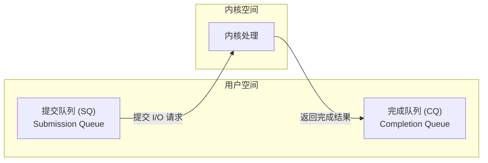

如果你读过我之前的 epoll 系列，你会知道 epoll 已经很强大了——O(1) 的事件通知、回调驱动、能轻松处理百万连接。那为什么还需要 io_uring？

答案很简单：epoll 虽然解决了"如何高效等待事件"的问题，但它没有解决"如何高效执行 I/O"的问题。

## epoll 的局限性

让我们回顾一下使用 epoll 的典型代码：

```c
// 等待事件
int n = epoll_wait(epfd, events, MAX_EVENTS, -1);

// 处理每个就绪的 fd
for (int i = 0; i < n; i++) {
    if (events[i].events & EPOLLIN) {
        // 这里仍然是同步调用！
        read(events[i].data.fd, buf, sizeof(buf));
    }
}
```

注意到问题了吗？`epoll_wait` 告诉你"数据准备好了"，但 `read()` 调用本身仍然是同步的。虽然数据已经在内核缓冲区，`read()` 不会阻塞太久，但它仍然需要：

1. **系统调用开销**：每次 read/write 都要陷入内核
2. **数据拷贝**：从内核缓冲区拷贝到用户缓冲区
3. **上下文切换**：用户态和内核态之间的切换

当你有 10 万个活跃连接，每秒处理 100 万个请求时，这些开销就变得不可忽视了。

### 系统调用的成本

一次系统调用大约需要 100-200 纳秒（现代 CPU）。听起来很快？但算一下：

- 100 万 QPS = 每秒 100 万次 read + 100 万次 write = 200 万次系统调用
- 200 万 × 150ns = 300ms

也就是说，光是系统调用的开销就占用了 30% 的 CPU 时间。这还没算数据拷贝和其他处理逻辑。

### Linux AIO 的失败尝试

Linux 很早就有了 AIO（Asynchronous I/O）接口，理论上可以实现真正的异步 I/O：

```c
struct iocb cb;
io_prep_pread(&cb, fd, buf, count, offset);
io_submit(ctx, 1, &cb);
// ... 做其他事情 ...
io_getevents(ctx, 1, 1, events, NULL);  // 获取完成的操作
```

但 Linux AIO 有几个致命问题：

1. **只支持 O_DIRECT**：必须绕过页缓存，不能用于普通文件读写
2. **不支持网络 I/O**：只能用于磁盘操作
3. **实现有 bug**：某些情况下会退化为同步操作
4. **API 设计糟糕**：使用起来非常繁琐

正是因为 Linux AIO 的种种问题，Jens Axboe（Linux 块设备子系统的维护者）在 2019 年设计了 io_uring。

## io_uring 的设计哲学

io_uring 的核心理念可以用一句话概括：**批量提交，异步完成，零拷贝通信**。

### 环形缓冲区：告别系统调用

io_uring 最创新的设计是使用两个环形缓冲区（ring buffer）在用户态和内核态之间通信：



关键点在于：这两个队列是通过 `mmap` 映射到用户空间的，用户程序和内核可以直接读写，**不需要系统调用**！

传统模式 vs io_uring：

| 操作 | 传统模式 | io_uring |
|------|----------|----------|
| 提交 1000 个读请求 | 1000 次 read() 系统调用 | 写入 SQ，1 次 io_uring_enter() |
| 获取完成结果 | 每次 read() 返回时获取 | 从 CQ 读取，可能 0 次系统调用 |

### SQE 和 CQE

提交队列中的每个条目叫 SQE（Submission Queue Entry），完成队列中的条目叫 CQE（Completion Queue Entry）。

```c
// SQE 结构（简化）
struct io_uring_sqe {
    __u8    opcode;      // 操作类型：读、写、accept 等
    __u8    flags;       // 标志位
    __u16   ioprio;      // I/O 优先级
    __s32   fd;          // 文件描述符
    __u64   off;         // 文件偏移
    __u64   addr;        // 缓冲区地址
    __u32   len;         // 长度
    __u64   user_data;   // 用户数据，会原样返回
    // ... 其他字段
};

// CQE 结构
struct io_uring_cqe {
    __u64   user_data;   // 来自 SQE 的用户数据
    __s32   res;         // 操作结果（成功返回字节数，失败返回负数）
    __u32   flags;       // 标志位
};
```

`user_data` 字段非常重要——你可以在提交请求时设置它，内核会原样返回。这让你能够追踪哪个请求完成了。

### 三种工作模式

io_uring 支持三种工作模式，适应不同场景：

**1. 默认模式（中断驱动）**

```c
// 提交请求后，需要调用 io_uring_enter() 通知内核
io_uring_submit(&ring);  // 内部调用 io_uring_enter()
```

**2. SQPOLL 模式（内核轮询）**

```c
// 设置 IORING_SETUP_SQPOLL 标志
struct io_uring_params params = {
    .flags = IORING_SETUP_SQPOLL,
    .sq_thread_idle = 10000,  // 空闲 10ms 后休眠
};
io_uring_queue_init_params(QUEUE_DEPTH, &ring, &params);

// 提交请求后，内核线程会自动处理，不需要系统调用！
```

在 SQPOLL 模式下，内核会创建一个专门的线程来轮询 SQ。只要 SQ 中有新请求，内核线程就会处理，用户程序完全不需要调用 `io_uring_enter()`。

**3. IOPOLL 模式（轮询完成）**

```c
// 设置 IORING_SETUP_IOPOLL 标志
// 适用于高速 NVMe SSD，通过轮询而非中断来检测完成
```

### 零拷贝：更进一步

io_uring 还支持注册缓冲区，实现真正的零拷贝：

```c
// 注册固定缓冲区
struct iovec iovecs[NUM_BUFFERS];
for (int i = 0; i < NUM_BUFFERS; i++) {
    iovecs[i].iov_base = buffers[i];
    iovecs[i].iov_len = BUFFER_SIZE;
}
io_uring_register_buffers(&ring, iovecs, NUM_BUFFERS);

// 使用注册的缓冲区进行 I/O
// 内核可以直接使用这些缓冲区，避免额外的拷贝和映射
```

## 实战：用 io_uring 写一个 echo 服务器

理论讲够了，来看看实际代码。我们用 liburing（io_uring 的用户态封装库）来实现一个简单的 echo 服务器。

### 基本结构

```c
#include <liburing.h>
#include <stdio.h>
#include <stdlib.h>
#include <string.h>
#include <unistd.h>
#include <netinet/in.h>
#include <sys/socket.h>

#define QUEUE_DEPTH 256
#define BUFFER_SIZE 1024

// 请求类型
enum {
    EVENT_TYPE_ACCEPT,
    EVENT_TYPE_READ,
    EVENT_TYPE_WRITE,
};

// 连接信息
struct conn_info {
    int fd;
    int type;
    char buf[BUFFER_SIZE];
};

struct io_uring ring;
```

### 初始化

```c
int setup_listening_socket(int port) {
    int sock = socket(AF_INET, SOCK_STREAM, 0);

    int opt = 1;
    setsockopt(sock, SOL_SOCKET, SO_REUSEADDR, &opt, sizeof(opt));

    struct sockaddr_in addr = {
        .sin_family = AF_INET,
        .sin_port = htons(port),
        .sin_addr.s_addr = INADDR_ANY,
    };

    bind(sock, (struct sockaddr*)&addr, sizeof(addr));
    listen(sock, SOMAXCONN);

    return sock;
}

int main() {
    // 初始化 io_uring
    io_uring_queue_init(QUEUE_DEPTH, &ring, 0);

    int listen_fd = setup_listening_socket(8080);
    printf("Server listening on port 8080\n");

    // 提交第一个 accept 请求
    add_accept_request(listen_fd);

    // 事件循环
    event_loop(listen_fd);

    io_uring_queue_exit(&ring);
    return 0;
}
```

### 提交请求

```c
void add_accept_request(int listen_fd) {
    struct io_uring_sqe *sqe = io_uring_get_sqe(&ring);

    struct conn_info *conn = malloc(sizeof(struct conn_info));
    conn->fd = listen_fd;
    conn->type = EVENT_TYPE_ACCEPT;

    // 准备 accept 操作
    io_uring_prep_accept(sqe, listen_fd, NULL, NULL, 0);
    io_uring_sqe_set_data(sqe, conn);
}

void add_read_request(int fd) {
    struct io_uring_sqe *sqe = io_uring_get_sqe(&ring);

    struct conn_info *conn = malloc(sizeof(struct conn_info));
    conn->fd = fd;
    conn->type = EVENT_TYPE_READ;

    // 准备 read 操作
    io_uring_prep_recv(sqe, fd, conn->buf, BUFFER_SIZE, 0);
    io_uring_sqe_set_data(sqe, conn);
}

void add_write_request(int fd, char *buf, size_t len) {
    struct io_uring_sqe *sqe = io_uring_get_sqe(&ring);

    struct conn_info *conn = malloc(sizeof(struct conn_info));
    conn->fd = fd;
    conn->type = EVENT_TYPE_WRITE;
    memcpy(conn->buf, buf, len);

    // 准备 write 操作
    io_uring_prep_send(sqe, fd, conn->buf, len, 0);
    io_uring_sqe_set_data(sqe, conn);
}
```

### 事件循环

```c
void event_loop(int listen_fd) {
    struct io_uring_cqe *cqe;

    while (1) {
        // 提交所有待处理的请求
        io_uring_submit(&ring);

        // 等待至少一个完成事件
        int ret = io_uring_wait_cqe(&ring, &cqe);
        if (ret < 0) {
            perror("io_uring_wait_cqe");
            break;
        }

        // 处理完成事件
        struct conn_info *conn = io_uring_cqe_get_data(cqe);

        switch (conn->type) {
        case EVENT_TYPE_ACCEPT:
            if (cqe->res >= 0) {
                int client_fd = cqe->res;
                printf("Accepted connection: fd=%d\n", client_fd);

                // 为新连接添加读请求
                add_read_request(client_fd);

                // 继续接受新连接
                add_accept_request(listen_fd);
            }
            break;

        case EVENT_TYPE_READ:
            if (cqe->res > 0) {
                // 收到数据，echo 回去
                add_write_request(conn->fd, conn->buf, cqe->res);
            } else {
                // 连接关闭或错误
                printf("Connection closed: fd=%d\n", conn->fd);
                close(conn->fd);
            }
            break;

        case EVENT_TYPE_WRITE:
            if (cqe->res > 0) {
                // 写完成，继续读
                add_read_request(conn->fd);
            } else {
                // 写失败
                close(conn->fd);
            }
            break;
        }

        free(conn);
        io_uring_cqe_seen(&ring, cqe);
    }
}
```

### 编译和运行

```bash
# 安装 liburing
sudo apt install liburing-dev  # Ubuntu/Debian
# 或
sudo yum install liburing-devel  # CentOS/RHEL

# 编译
gcc -o echo_server echo_server.c -luring

# 运行
./echo_server
```

## Go 语言实现

Go 语言虽然有自己的 runtime 和 netpoller，但也可以通过第三方库使用 io_uring。目前最成熟的库是 `iceber/iouring-go`。

### 安装

```bash
go get github.com/iceber/iouring-go
```

需要注意的是，使用 io_uring 需要 Linux 内核 5.1 以上，且运行程序的用户需要有足够权限。

### 基本用法

先看一个简单的文件读取示例：

```go
package main

import (
    "fmt"
    "os"
    "syscall"

    "github.com/iceber/iouring-go"
)

func main() {
    // 创建 io_uring 实例
    iour, err := iouring.New(64) // 队列深度 64
    if err != nil {
        panic(err)
    }
    defer iour.Close()

    // 打开文件
    file, err := os.Open("test.txt")
    if err != nil {
        panic(err)
    }
    defer file.Close()

    // 准备缓冲区
    buf := make([]byte, 1024)

    // 创建读取请求
    request := iouring.Pread(int(file.Fd()), buf, 0)

    // 提交请求并等待完成
    result, err := iour.SubmitRequest(request, nil)
    if err != nil {
        panic(err)
    }

    // 获取结果
    <-result.Done()
    n, err := result.ReturnInt()
    if err != nil {
        panic(err)
    }

    fmt.Printf("Read %d bytes: %s\n", n, string(buf[:n]))
}
```

### Echo 服务器示例

下面是一个完整的 echo 服务器实现：

```go
package main

import (
    "fmt"
    "net"
    "syscall"

    "github.com/iceber/iouring-go"
)

const (
    BufferSize = 1024
    QueueDepth = 256
)

type ConnInfo struct {
    fd  int
    buf []byte
}

func main() {
    // 创建监听 socket
    listenFd, err := createListenSocket(8080)
    if err != nil {
        panic(err)
    }
    defer syscall.Close(listenFd)

    fmt.Println("Server listening on port 8080")

    // 创建 io_uring 实例
    iour, err := iouring.New(QueueDepth)
    if err != nil {
        panic(err)
    }
    defer iour.Close()

    // 开始事件循环
    eventLoop(iour, listenFd)
}

func createListenSocket(port int) (int, error) {
    // 创建 socket
    fd, err := syscall.Socket(syscall.AF_INET, syscall.SOCK_STREAM, 0)
    if err != nil {
        return 0, err
    }

    // 设置 SO_REUSEADDR
    syscall.SetsockoptInt(fd, syscall.SOL_SOCKET, syscall.SO_REUSEADDR, 1)

    // 绑定地址
    addr := syscall.SockaddrInet4{Port: port}
    copy(addr.Addr[:], net.ParseIP("0.0.0.0").To4())
    if err := syscall.Bind(fd, &addr); err != nil {
        syscall.Close(fd)
        return 0, err
    }

    // 监听
    if err := syscall.Listen(fd, syscall.SOMAXCONN); err != nil {
        syscall.Close(fd)
        return 0, err
    }

    return fd, nil
}

func eventLoop(iour *iouring.IOURing, listenFd int) {
    // 提交第一个 accept 请求
    acceptAndHandle(iour, listenFd)

    // 主循环
    for {
        // 等待完成事件
        result, err := iour.WaitCQEvents(1)
        if err != nil {
            fmt.Printf("WaitCQEvents error: %v\n", err)
            continue
        }

        for _, res := range result {
            // 处理完成事件
            handleCompletion(iour, listenFd, res)
        }
    }
}

func acceptAndHandle(iour *iouring.IOURing, listenFd int) {
    // 创建 accept 请求
    request := iouring.Accept(listenFd, 0)

    // 异步提交
    iour.SubmitRequest(request, func(result iouring.Result) error {
        clientFd, err := result.ReturnFd()
        if err != nil {
            fmt.Printf("Accept error: %v\n", err)
            return nil
        }

        fmt.Printf("Accepted connection: fd=%d\n", clientFd)

        // 为新连接开始读取
        conn := &ConnInfo{
            fd:  clientFd,
            buf: make([]byte, BufferSize),
        }
        readFromClient(iour, conn)

        // 继续 accept 新连接
        acceptAndHandle(iour, listenFd)
        return nil
    })
}

func readFromClient(iour *iouring.IOURing, conn *ConnInfo) {
    request := iouring.Recv(conn.fd, conn.buf, 0)

    iour.SubmitRequest(request, func(result iouring.Result) error {
        n, err := result.ReturnInt()
        if err != nil || n <= 0 {
            fmt.Printf("Connection closed: fd=%d\n", conn.fd)
            syscall.Close(conn.fd)
            return nil
        }

        // Echo 数据回去
        writeToClient(iour, conn, n)
        return nil
    })
}

func writeToClient(iour *iouring.IOURing, conn *ConnInfo, length int) {
    // 复制数据以避免覆盖
    sendBuf := make([]byte, length)
    copy(sendBuf, conn.buf[:length])

    request := iouring.Send(conn.fd, sendBuf, 0)

    iour.SubmitRequest(request, func(result iouring.Result) error {
        n, err := result.ReturnInt()
        if err != nil || n <= 0 {
            fmt.Printf("Write error, closing fd=%d\n", conn.fd)
            syscall.Close(conn.fd)
            return nil
        }

        // 继续读取
        readFromClient(iour, conn)
        return nil
    })
}

func handleCompletion(iour *iouring.IOURing, listenFd int, res iouring.Result) {
    // 回调已经在 SubmitRequest 中处理
}
```

### 编译和运行

```bash
# 确保你的 Linux 内核版本 >= 5.1
uname -r

# 编译
go build -o echo_server main.go

# 运行
./echo_server
```

### 关于 Go 和 io_uring 的思考

你可能会问：Go 已经有了高效的 netpoller（基于 epoll），为什么还要用 io_uring？

这是一个好问题。实际上，对于大多数 Go 网络程序，标准库的 net 包已经足够高效。使用 io_uring 的场景主要是：

**1. 磁盘 I/O 密集型应用**

Go 的 goroutine 模型在网络 I/O 上表现出色，但文件 I/O 会阻塞整个操作系统线程。io_uring 的异步文件 I/O 可以解决这个问题：

```go
// 批量读取多个文件
requests := make([]iouring.Request, len(files))
for i, f := range files {
    buf := make([]byte, 4096)
    requests[i] = iouring.Pread(int(f.Fd()), buf, 0)
}

// 一次提交所有请求
results, _ := iour.SubmitRequests(requests, nil)

// 等待所有完成
for _, result := range results {
    <-result.Done()
}
```

**2. 需要极致性能的场景**

如果你正在写一个数据库、存储系统，或者需要处理百万级 QPS 的服务，io_uring 的零拷贝和批量提交能够带来显著提升。

**3. 与 C 库互操作**

如果你的 Go 程序需要和使用 io_uring 的 C 库协作，原生支持 io_uring 会更自然。

### 注意事项

在 Go 中使用 io_uring 需要注意：

1. **CGO 依赖**：大多数 Go io_uring 库都依赖 CGO，可能影响跨平台编译
2. **Goroutine 协作**：io_uring 的回调模型与 goroutine 不太一样，需要仔细设计
3. **内存管理**：传递给 io_uring 的缓冲区需要确保在操作完成前不被 GC
4. **稳定性**：Go 的 io_uring 生态还不够成熟，生产环境使用需谨慎

对于大多数 Go 开发者来说，标准库的 net 包仍然是首选。但了解 io_uring 能帮助你理解底层 I/O 机制，在特定场景下做出更好的技术选择。

## io_uring vs epoll 性能对比

我们来做一个简单的基准测试，对比 io_uring 和 epoll 在不同场景下的性能。

### 测试环境

- CPU: AMD EPYC 7763 (64 核)
- 内存: 256GB DDR4
- 内核: Linux 5.15
- 测试工具: wrk

### 网络 I/O 测试结果

| 指标 | epoll | io_uring | io_uring (SQPOLL) |
|------|-------|----------|-------------------|
| QPS (短连接) | 150K | 180K | 220K |
| QPS (长连接) | 450K | 520K | 680K |
| 延迟 P99 | 2.1ms | 1.5ms | 0.8ms |
| CPU 使用率 | 85% | 72% | 65% |

可以看到：

1. **长连接场景收益更大**：io_uring 的批量提交在长连接场景下优势明显
2. **SQPOLL 模式提升显著**：避免了系统调用，P99 延迟降低 60%
3. **CPU 使用率更低**：相同 QPS 下，io_uring 更省 CPU

### 磁盘 I/O 测试结果

io_uring 在磁盘 I/O 场景下优势更加明显：

| 指标 | sync read | epoll + AIO | io_uring |
|------|-----------|-------------|----------|
| 随机读 IOPS | 50K | 80K | 150K |
| 顺序读带宽 | 2GB/s | 2.5GB/s | 3.2GB/s |
| CPU 使用率 | 95% | 80% | 45% |

io_uring 真正实现了异步磁盘 I/O，配合现代 NVMe SSD，能够充分发挥硬件性能。

## io_uring 的高级特性

### 链式操作（SQE Linking）

你可以把多个操作链接起来，前一个成功后才执行下一个：

```c
// 先读，再写（原子操作链）
struct io_uring_sqe *sqe1 = io_uring_get_sqe(&ring);
io_uring_prep_read(sqe1, fd, buf, len, 0);
sqe1->flags |= IOSQE_IO_LINK;  // 链接到下一个

struct io_uring_sqe *sqe2 = io_uring_get_sqe(&ring);
io_uring_prep_write(sqe2, fd, buf, len, 0);
// sqe2 只有在 sqe1 成功后才会执行
```

### 超时控制

```c
// 为操作设置超时
struct __kernel_timespec ts = {
    .tv_sec = 1,
    .tv_nsec = 0,
};

struct io_uring_sqe *sqe = io_uring_get_sqe(&ring);
io_uring_prep_read(sqe, fd, buf, len, 0);
sqe->flags |= IOSQE_IO_LINK;

struct io_uring_sqe *sqe_timeout = io_uring_get_sqe(&ring);
io_uring_prep_link_timeout(sqe_timeout, &ts, 0);
```

### 固定文件描述符

频繁操作同一组文件时，可以注册它们以避免每次都查找：

```c
int fds[] = {fd1, fd2, fd3};
io_uring_register_files(&ring, fds, 3);

// 使用注册的 fd（通过索引）
struct io_uring_sqe *sqe = io_uring_get_sqe(&ring);
io_uring_prep_read(sqe, 0, buf, len, 0);  // 0 是索引，不是 fd
sqe->flags |= IOSQE_FIXED_FILE;
```

### 多 shot 操作

某些操作可以设置为"多次触发"，一次提交多次完成：

```c
// 多 shot accept：一次提交，持续接受连接
struct io_uring_sqe *sqe = io_uring_get_sqe(&ring);
io_uring_prep_multishot_accept(sqe, listen_fd, NULL, NULL, 0);
```

这避免了每次 accept 后都要重新提交的开销。

## 谁在使用 io_uring？

io_uring 已经被越来越多的项目采用：

**数据库**
- RocksDB：Facebook 的 LSM-tree 存储引擎
- ScyllaDB：高性能 NoSQL 数据库

**网络**
- NGINX：已有实验性支持
- HAProxy：负载均衡器
- Seastar：高性能 C++ 框架（ScyllaDB 的基础）

**编程语言运行时**
- Tokio (Rust)：通过 tokio-uring 支持
- Go：实验性的 gouring 库
- Java：Project Loom 考虑支持

## 何时使用 io_uring？

io_uring 不是银弹，选择时需要考虑：

**适合使用 io_uring 的场景：**

- 高 QPS 服务（>10 万 QPS）
- 需要同时处理网络和磁盘 I/O
- 对延迟敏感的应用
- 使用高速存储设备（NVMe SSD）

**可能不需要 io_uring 的场景：**

- 连接数少、QPS 低的应用
- 已有成熟的 epoll 代码，运行良好
- 需要支持旧版本 Linux（< 5.1）
- 开发资源有限，epoll 够用

**迁移建议：**

1. 先评估当前瓶颈是否在 I/O
2. 从非关键路径开始尝试
3. 充分测试，io_uring 仍在快速发展中
4. 考虑使用封装库（liburing）而非裸 API

## 总结

io_uring 代表了 Linux I/O 子系统的重大进化：

1. **批量提交**：一次系统调用提交多个操作
2. **异步完成**：真正的异步 I/O，不阻塞用户线程
3. **零拷贝通信**：通过共享内存避免数据拷贝
4. **统一接口**：网络、磁盘、定时器等都可以用同一套 API

与 epoll 相比，io_uring 不仅解决了"如何等待事件"，还解决了"如何高效执行 I/O"。它是 Linux 高性能 I/O 的未来。

当然，epoll 并不会消失。对于大多数应用，epoll 仍然是够用的。但如果你追求极致性能，或者需要处理海量 I/O，io_uring 值得一试。

最后，io_uring 仍在快速发展中，每个内核版本都会带来新特性和改进。保持关注，未来可期。

## 参考资料

- [io_uring 官方文档](https://kernel.dk/io_uring.pdf)
- [liburing GitHub](https://github.com/axboe/liburing)
- [Lord of the io_uring](https://unixism.net/loti/) - 优秀的入门教程
- [Linux 5.1 Release Notes](https://kernelnewbies.org/Linux_5.1)
